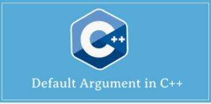
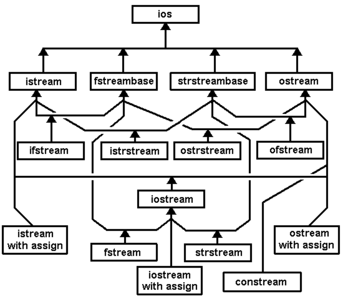
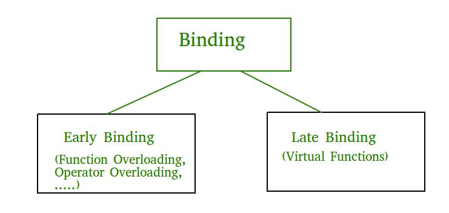

 

# Lucidi C++ 2022  

## *[Prof. Fabrizio Sacco](http://fabriziosacco.it)*

## *(C++ per programmatori C)*


|          ")           |
| :----------------------------------------------------------: |
| **B. Stroustrup** (AT&amp;T) - Inventore del C++ -  https://www.stroustrup.com/ |


# Nascita del linguaggio 


- ## Anni 80: si aggiunsero caratteristiche nuove al C


- ## I primi compilatori C++ erano dei traduttori da C++ a C


- ## Il C++ oggi contiene tutti gli elementi del C ANSI


## Risorse on line:

| [Download C/C++ Compiler (Codeblocks/DevCpp Mingw 9)](https://mega.nz/folder/99kjEA7L#1znYccLdgqga4VRv3_jBoA) *(versione F. Sacco, con WinBgim, SFML, etc. )* |
| ------------------------------------------------------------ |
| [On Line C++ Compiler](http://www.tutorialspoint.com/codingground.htm) |
| [Tutorial Completo C++](http://www.tutorialspoint.com/codingground.htm) |


# Primo programmi in C++ 

```c
/* Primo programma scritto in C! */
include <stdio.h>   // OnLineCompiler:[https://www.jdoodle.com/online-compiler-c++14/]
int main()
{
	printf("Ciao mondo\n");
	return 0;
}
```


## Lo stesso in C++
```cpp
#include <iostream> // OnLineCompiler:[https://www.jdoodle.com/online-compiler-c++14/]
using namespace std;
int main()
{
	cout << "Ciao mondo" << endl;
	return 0;
}
```


# ALCUNI PUNTI DI FORZA DEL C++ 

## 1. **Stretto controllo sui tipi**


## 2. **Migliorato l'I/O standard**


## 3. **Overload operatori e funzioni**


## 4. **Riferimenti**


## 5. Programmazione ad oggetti (Oggetti, ereditarietà completa, template)


## 6. Semplicità ed uniformità (anche nel riutilizzo del proprio codice, classi di oggetti standard)


## 7. Completa compatibilità dei moduli già scritti in C


## 8. Disponibilità in tutti gli ambienti di sviluppo (Win, Linux, Unix, Mac, Etc.)


# Introduzione all'I/O in C++


```cpp
/* Ecco un esempio di I/O in C */

include <stdio.h>   // OnLineCompiler:[https://www.jdoodle.com/online-compiler-c++14/]
int main()
{
   int i;
   long l;
   printf(" Due numeri ..");
   scanf("%d",&i);
   scanf("%ld",&i);
   printf("Numeri: %d %ld",i,l);
   return 0;
}
```

```Cpp
// Lo stesso in C++

#include <iostream> // OnLineCompiler:[https://www.jdoodle.com/online-compiler-c++14/]
using namespace std;

int main()
{
        int i;
        long l;
        cout << " Due numeri ..";
        cin  >> i;
        cin  >> l;
        cout << "Numeri: " << i << " " << l;
        return 0;
}
// NB: << e >> sono operatori di flusso, cin, cout (e cerr) sono oggetti
// che rappresentano input, output ed error standard
```

```Cpp
// Ancora un Esempio di I/O: Tabellina 

#include <iostream> // OnLineCompiler:[https://www.jdoodle.com/online-compiler-c++14/]
using namespace std;

int main(void)
{
  int tabel;

  cout << "Tabellina del..";
  cin >> tabel;   
  for(int cont = 1; cont <= 10; cont++)
       cout << tabel << " per " << cont << " fa " << cont * tabel << "\n";
  return 0;
}
```

# Esercizi I/O

## 1) Calcolare la somma e la media di n numeri letti dall'input standard


## 2) Calcolare il massimo e il minimo fra n numeri letti dall'input standard


## 3) Riempire un vettore di numeri letti da input e ordinare il vettore (bubble sort) e poi visualizzare il vettore ordinato

```Cpp
// Aiuto Bubble Sort (variante):

for(i=0; i< elementi-1; i++)
    for(j=i+1; j < elementi; j++)
        if (v[i]>v[j])
            //scambia i due elementi
```


# **OPERATORE :: E CAST**

## Cast e operatore di risoluzione ambito d'azione

```Cpp
// Un programma ... da dimenticare!!!

#include <iostream> // OnLineCompiler:[https://www.jdoodle.com/online-compiler-c++14/]
using namespace std;

const int PER_RIGA = 5;
int i =   PER_RIGA;

int main()
{
    for ( int i = 160; i < 255; i++)
    {
           cout << i << " --> " << char(i) << " ";
           if (::i-- == 1 ) // Che fa????
             ::i = PER_RIGA, cout << "\n"; // Che fa???
    }
    return 0;
}

```

## NB: 

## :: è l'operatore di risoluzione ambito d'azione

### *tipo(n)* è un cast, come *(tipo) n*, quest'ultimo unico accettato in C 


# **FORMATTAZIONE CON I MANIPOLATORI**


```cpp
// Manipolatori a base numerica

#include <iostream> // OnLineCompiler:[https://www.jdoodle.com/online-compiler-c++14/]
using namespace std;

int main()
{
        int a;
        cout << "Dammi un numero ...";
        cin >> a;
        cout << "In esad. " <<hex<<a<<endl;
        cout << "In ott.  " <<oct<<a<<endl;
        cout << "in dec.  " <<dec<<a<<endl;
        return 0;
}

// NB: La base impostata resta attiva //(fino al cambio)
// I manipolatori hex, oct, dec valgono anche per l'input con cin
```


## Esercizio: **scrivere un programma di conversione numeri da base 8, 10, 16 a base 8, 10, 16.**


### PS: esiste anche la possibilità di usare *bitset* per ottenere numeri in binario

```Cpp
#include <iostream> // OnLineCompiler:[https://www.jdoodle.com/online-compiler-c++14/]
#include <bitset>
using namespace std;
int main()
{
    int a=126;
    bitset<8>  x(a);
    cout << "Binario (8  bit)= "<< x << '\n';
    bitset<16> y(a);
    cout << "Binario (16 bit)=" << y << '\n';
    return 0;
}
```

# Manipolatori di controllo del formato *setw()* e *setprecision()*


```Cpp
#include <iostream> // OnLineCompiler:[https://www.jdoodle.com/online-compiler-c++14/]
#include <iomanip>
using namespace std;
int main()
{
  int a = 3, b = 4, c = 5;

  cout << a << b << c << '\n';
  cout << setw(5) << a << setw(5)
  << b << setw(5) << c << '\n';
  cout << "CIAO\n";
  cout << setw(40) << "CIAO\n";  // setw() non ha memoria!
  
  double f =1.123456789; // esempio di setprecision 
  cout << " 5->" << setprecision(5) << f << '\n';
  cout << " 8->" << setprecision(8) << f << '\n';
  cout << " 3->" << setprecision(3) << f << '\n';
  cout << "10->" << setprecision(10) << f << '\n';
  return 0;
}
```

### **NB: Notate che setprecision() mantiene memoria, mentre setw() no.**


## **I manipolatori: *setiosflags()* **

##  (c'è anche *resetiosflags()*)


```Cpp
#include <iostream> // OnLineCompiler:[https://www.jdoodle.com/online-compiler-c++14/]
#include <iomanip>
using namespace std;

int main()
{
  int i = 193;  float x = 75.92;
  // Allineo a sinistra e poi a destra
  cout<<setw(20)<<setiosflags(ios::left) <<i<<'\n';
  cout<<setw(20)<<setiosflags(ios::right)<<i<<'\n';
  // Stampa in notazione scientifica (L'allineamento e' ancora attivo!)
  cout<<setiosflags(ios::scientific)<<x<<'\n';
  return 0;
}
```


# **Obbligatorietà del prototipo:**


```Cpp
// Programma In C, salvato in .c oppure in .cpp  

include <stdio.h>   // OnLineCompiler:[https://www.jdoodle.com/online-compiler-c++14/]
#include <string.h>  // prova a togliere questa linea

int main()
{
    char s[40];
    int  l;
    strcpy(s,"ciao");
    l = strlen(s);
    printf("l = %d, s = %s",l,s);
    return 0;
}

```

## NB: **Il programma, salvato come .c e compilato come programma C funziona anche senza i prototipi (appaiono solo warnings): provate a togliere o a commentare gli #include**

### Invece in C++ la mancanza dei prototipi (definiti negli header, o file .h) o la loro incompletezza NON viene accettata

### Prova a salvare il programma in un file .cpp e compila: già alla *strcpy* il compilatore C++ segnala errore!!!


# **I riferimenti: nomi alternativi per valori e variabili**


```Cpp
// Codice C (funziona comunque anche in C++)

void scambia1(int *p, int *q)   
// Passaggio per indirizzo (OK in C e in  C++)
{
        int dep = *p;
        *p      = *q;
        *q      =  dep;
}
```


```Cpp
// Codice C++ (funziona SOLO in C++)

void scambia2(int &a, int &b) 
//Passaggio per riferimento (OK solo in C++)
{
        int dep  = a;
        a        = b;
        b        = dep;
}
```


```Cpp
int main() // Compilare in C++, aggiungi header e cstdio
{
        int a = 7, b = 5;

        scambia1(&a,&b);  // Alla C
        printf(" a = %d, b = %d\n",a,b);

        scambia2(a,b); // Alla C++
        printf(" a = %d, b = %d\n",a,b);
    	return 0;
}
```


# Allocazione della memoria (Array)


## **Si possono usare ancora malloc() e free(), ma il C++ provvede due nuove funzioni: *new() e delete()***

```Cpp
#include <iostream> // OnLineCompiler:[https://www.jdoodle.com/online-compiler-c++14/]
#include <iomanip>
#include <new> // Header X new/delete
#include <cstdlib> //vecchia stdlib.h per exit() in fine_memoria()
using namespace std;

void fine_memoria()   
// se la new dovesse fallire, verrebbe attivata
{
        cout << "FINE MEMORIA ";
        exit(0); // Termina programma 
}

int main()
{
        int  *v;  // In C++ abbiamo anche la classe vector della STL. 
    			  // Comunque qui creiamo un vettore "puro" che si 
                  // adatta alla dimensione desiderata
        long i,n;
        set_new_handler(fine_memoria);
        cout << "Quanti numeri interi ?";
        cin >> n; // Meglio controllare che n >= 1!!!
    
        v = new int[n]; // Alloco memoria, a tutti gli effetti v 
        // diventa un vettore di n elementi!
        // in C si fa: 	v = (int*) malloc(n*sizeof(int)); 
    
    	for ( i = 0; i < n; i++)
                v[i] = i;  // Riempio in qualche modo il vettore v[]
        for (i = --n; i >=0; i--)
                cout << setw(7) << v[i]; // Visualizzo il vettore v[]
        
    	delete [] v;    // Libero memoria, v ritorna ad essere solo un puntatore
    	// in C c'era: free(v);
        
    return 0;
}
```

# Allocazione memoria e lettura file

### Si supponga di caricare dati (in questo caso numeri interi) da file di testo. Dato un file di testo nella seguente forma (NB: il primo valore rappresenta il numero di elementi nel file, in questo caso il 10)

```
10
5
17
6
-2
5
8
15
17
-9
1
```

#### Si desidera caricare in memoria in un array il file. In C avremmo usato funzioni come *fopen, fscanf, fclose*... In C++ possiamo fare così:

```cpp
#include <iostream> // OnLineCompiler:[https://www.jdoodle.com/online-compiler-c++14/]
#include <fstream>  // per ifstream/ofstream
// ifstream=apertura in lettura, ofstream=apertura in scrittura
using namespace std;

int main() {
	int n;   // numero elementi del file
    int *v;  // pointer usato come vettore dinamico
	ifstream fd("numeri.txt"); // Apertura del file in lettura
	fd >> n; // lettura da file del numero di elementi
    // Nota che la sintassi e' praticamente la stessa della lettura 
    // da input standard, cioè cin >> n;
    v = new int[n]; // Alloco memoria, v diventa un vettore di n elementi!	
    for(int i = 0; i < n; i++) 
		fd >> v[i]; // Lettura degli n elementi del file	
    for(int i = n-1; i >= 0; i--)
		cout << v[i] << endl; // li visualizzo in ordine inverso	
    delete [] v;    // Libero memoria
	return 0;
}
/*** Esercizio:
Modificare il programma qui sopra in modo che
1) Legga i numeri dal qualsiasi file, chiedendo il nome del file
2) Ordini il vettore
3) Salvi il vettore ordinato nel file "numeri_in_ordine.txt" ( usare ofstream() ) 
4) Salvi il vettore ordinato in una tabella html (file .html)
***/
```


# Approfondimento sui file, file [CSV](https://it.wikipedia.org/wiki/Comma-separated_values)

### I file CSV costituiscono un ottimo formato per scambiare i dati fra foglio elettronico (Libreoffice, Excel, etc.) e programmi scitti in C++

### Supponiamo di avere un foglio elettronico di nome *studenti* contenente un certo numero di informazioni di iscritti ad un certo corso, come qui sotto:


#### Ogni record (linea) contiene, oltre al cognome e nome dello studente, il sesso (M/F), la provincia di residenza, il numero di esami svolti (Colonna E) e il voto medio degli esami sostenuti (Colonna F)

#### Per rendere questi dati visibili facilmente ad un programma C++ possiamo esportarli, da foglio elettronico, nel formato testuale CSV (ogni dato è separato da una virgola) 

### File studenti.csv:

```
ALLORIO,GIANMARIA,M,TO,5,24
AMERIO,DOMENICA,F,AL,6,29
ANFOSSI,DOMENICO,M,PV,13,29
BARBIERI,LAURA,F,NO,11,25
BARBIERI,ROSSANA,F,TO,9,18
BARLETTA,ELISABETTA GIOVANNA,F,NO,14,18
BASILICO,TERESA,F,AT,4,29
BERTINATO,ANDREA,M,CN,8,19
BOJERI,ANTONELLA,F,CN,9,23
```

## Ora carico in memoria in un vettore di struct studente il file studenti.csv. Nota l'utilizzo della funzione C++ *getline()*

```cpp
#include <iostream> // OnLineCompiler:[https://www.jdoodle.com/online-compiler-c++14/]
#include <fstream>
#include <cstdlib>
#include <cstring>
using namespace std;

#define MAX 256 // Massimo numero linee file studenti.csv
#define LMAX 25 // Max lunghezza stringa

struct Studente{  
    char cognome[LMAX+1];
    char nome[LMAX+1];
    char sesso[2+2]; 
    char provincia[1+3];
    int n_esami;
    int media;
};

Studente vetts[MAX]; // Vettore di studenti 

const char *descrizioni[]= { "Cognome\t","Nome\t","Sesso\t","Provincia","N. esami","Voto medio",NULL};

void fatalerror(const char errore[])  // errore apertura file
{
    cout << errore;
    exit(1);
}

int leggi()
{
    
    char campo[LMAX+1];
	int nstud=0; // numeri di studenti
	Studente st; // appoggio
    ifstream fd("studenti.csv");  // dichiarazione e apertura in scrittura
    if (!fd.is_open())   // se il file non si e' aperto
        fatalerror("Errore apertura file in lettura");
    while(fd.getline(campo, LMAX, ','))  // pesco prox campo
    {
    	strcpy(st.cognome,campo);   // Copio in cognome
        fd.getline(campo,LMAX,','); // pesco prox campo
        strcpy(st.nome,campo);      // copio in nome
        fd.getline(campo, 3,',');   // pesco prox campo
        strcpy(st.sesso,campo);
        fd.getline(campo, 3,',');
        strcpy(st.provincia,campo);
        fd.getline(campo,LMAX,',' ); // pesco numero esami
		st.n_esami=atoi(campo);      // converto in int
        fd.getline(campo,LMAX,'\n');
		st.media=atoi(campo);
        vetts[nstud++]=st;  // aggiungo struttura sttruttura nel vettore 
    }
    fd.close();
    return nstud;   // se serve, numero di studenti letti 
}

void visualizza(Studente st, int numero)
{
	cout << "Studente N." << numero +1     << endl;
    cout << "Cognome:   " << st.cognome    << endl;
    cout << "Nome:      " << st.nome       << endl;
    cout << "Sesso:     " << st.sesso      << endl;
    cout << "Provincia: " << st.provincia  << endl;
    cout << "Esami:     " << st.n_esami    << endl;
    cout << "V. medio:  " << st.media      << endl;
    cout << "-----------------------------------\n";
}

int main()
{
    int studenti=leggi();
    for(int i=0; i < studenti; i++)
    	visualizza(vetts[i],i);
    return 0;
}

/*** 
Esercizi:
/// 1) Ordinare il vettore di studenti in base ad un campo scelto
	Aiuto (esempio campo esami): 

	#include <algorithm>
	.....
	bool compara_esami(studente s1, studente s2){ //ordino per esami
		return s1.n_esami > s2.n_esami;
	}

	sort(vetts, vetts+nstud, compara_esami); // ordinamento per esami

/// 2) Visualizzare a video il file ordinato
/// 3) Salvare il file ordinato in un file csv 
/// 4) Salvare il file ordinato in un file HTML (con tabella)

```


# Allocazione della memoria (Matrici)

### Proprio come un puntatore può  trasformarsi in un vettore, allocando lo spazio:

```Cpp
int *v = new int[dimensione];
```

### (dove **dimensione** è un intero che specifica la dimensione del vettore dinamico)...

## ...è possibile anche utilizzare un *doppio pointer* per definire una matrice (array bidimensionale)  dinamica partendo da, ad esempio, da un doppio pointer ad interi:


```Cpp
int **a;   
/* a==doppio puntatore ad intero: diventerà una matrice di qualunque dimensione (row,col) voluta */
```

## Puoi inizializzarlo... 

#### (immaginiamo row==numero di righe, col==numero di colonne della matrice che desidero creare)  usando un ciclo, in questo modo:

```Cpp
a = new int*[row];
for(int i = 0; i < row; ++i)
        a[i] = new int[col];
```

# Matrici dinamiche, continua

### Se, ad esempio, avessimo **col= 5 e row = 4,** produrrebbe una matrice come visualizzato qui sotto:


#### Non dimenticare di deallocare poi, quando la matrice non serve più, lo spazio in memoria utilizzato; occorre prima deallocare ogni riga separatamente con un ciclo prima di eliminare l'array di puntatori a:

```cpp
for(int i = 0; i < row; ++i) 
        delete [] a[i]; // prima elimino le righe, 
                        // deallocando i puntatori alle linee...
delete [] a; // ... e poi il doppio pointer
```

```
Esercizio:
Dato un file di nome "matrice.txt", in cui in prima linea sono indicate le dimensioni
(righe e colonne) della matrice di interi, caricare in memoria la matrice in un costrutto
di tipo:  int **matrice;
------------------------------------
Segue esempio di file "matrice.txt":
3 4
10 22 17 11
-4  0  5 87
 2  5 11 -5
```

# Overload di funzioni


### Un esempio: Come fornire l'istruzione accept (***in Cobol legge tipi diversi***) in C++?


#### Un modo semplice, utilizzando l'overload di funzioni, è:

```Cpp
#include <iostream> // OnLineCompiler:[https://www.jdoodle.com/online-compiler-c++14/]
#include <cstdlib>
using namespace std;

void accept(char *s, int lun) // lettura linea da standard input
{
   char c;
   while(cin.get(c) && c != '\n' && --lun)
                *s++ = c;
     *s = '\0';
}
void accept(int &n)  // passaggio x riferimento
{
   const int LUN=40;
   char s[LUN+1];
   accept(s,LUN);
   n = atoi(s); // atoi è in stdlib.h
}
void accept(int v[], const int lun)
{
     for (int i = 0; i < lun; i++)
          accept(v[i]);
}
```

# *Esercizi (function overload)*


## **1) Completare il programma inserendo un main() di prova**

## **2) Scrivere altrettante funzioni display con overload**

## 3) Definire una serie di funzioni sum() che permettano di sommare int + stringa, stringa + int, stringa + stringa, int + int (*vedi qui sotto*)

```cpp
sum("12","15"); // ritorna 27
sum(12,"10");   // ritorna 22
sum("10",12);   // ritorna 22
sum(10,15);     // ritorna 25

int sum (int x, int y){
	// codifica
}

int sum(const char x[], const char y[]){
	// codifica
}

int sum(const char *x, int y){
	// codifica
}

int sum(int x, const char *y){
	// codifica
}

int main(){
	cout << "La somma tra x + y -->: e'" << sum(12,15) << endl; ///somma due interi
	cout << "La somma tra 'x' + 'y' e' -->:" << sum("12", "10") << endl; ///somma due stringhe
	cout << "La somma tra 'x' + y e' -->:" << sum("10", 12) << endl; ///somma stringa e intero
	cout << "La somma tra x + 'y' e' -->:" << sum(10, "15") << endl; ///somma intero e stringa
	return 0;
}
```

## 4) Facoltativo:

```cpp
int sum("duequattro","unozero"); // interpreta: 24+10=34 ritornando 34
```

# **FUNZIONI: Argomenti di default**



```Cpp
#include <iostream> // OnLineCompiler:[https://www.jdoodle.com/online-compiler-c++14/]
using namespace std;

void err_msg(char msg[] = "ERRORE !")
{
   char c;
   cout << msg;
   cout << "Premi invio per continuare ...";
   cin.get(c);   // getchar() in C++
}

int main()
{
        err_msg();     
        err_msg("OK,");
        return 0;
}
```

### **NB:**

**Se ci sono parametri di default e non, come qui sotto:**

```Cpp
int abc(int a,int b,char c = 'A',long l = 10)
```

## **i parametri di default vanno posizionati a *destra***


# **Classi e oggetti** in C++


```Cpp
#include <iostream> // OnLineCompiler:[https://www.jdoodle.com/online-compiler-c++14/]
using namespace std;

class data {
                int giorno;
                int mese;
                int anno;
           };     // data e' una classe

data  d1,d2; // d1 e d2 sono oggetti
             // cioe' istanze di data


int main()
{
           d1.giorno = 31;       // ERRORE
           d1.mese   = 1;        // ERRORE
           d1.anno   = 1996;     // ERRORE
           d2 = d1;              // OK
           return 0;
}

```

### NB: *Le classi (*class*) differiscono dalle strutture (*struct*), in quanto nelle classi i campi (ad es. giorno, mese o anno in date) sono di default PRIVATI; si possono rendere pubblici con la direttiva *"public:"* Chiameremo ATTRIBUITI (o proprietà) i campi nelle classi.


# Classi e oggetti:

## Attributi (campi) pubblici e privati


```Cpp
include <iostream>
using namespace std;

class data {
              int minuto;
              int ora;  // attributi privati
            public:
              int giorno;// attributi pubblici
              int mese;
              int anno;
           };

int main()
{
    	   data  d1,d2;    // d1 e d2 sono oggetti di tipo data
    
           d1.minuto = 23;       // ERRORE
           d1.ora    =  7;       // ERRORE
           d1.giorno = 31;       // OK
           d1.mese   = 1;        // OK
           d1.anno   = 1996;     // OK
           d2 = d1;              // OK
           return 0;
}
```

### NB: **Esiste anche la direttiva “*private*:” che e' il contrario di “*public:*”. E' superflua per le classi ma può servire per rendere privato un campo di una *struct***


# Classi e oggetti: METODI 


```Cpp
#include <iostream> // OnLineCompiler:[https://www.jdoodle.com/online-compiler-c++14/]
using namespace std;

class data { 
    int giorno, mese, anno; // attributi privati
public:
// metodo set() (funzione interna) di classe data:
   void set(const int g, const int m, const int a)
   { giorno = g, mese = m, anno = a; }

// metodo print() (funzione interna) di classe data:
        void print()
        {       cout << giorno <<  '/';
                cout << mese   <<  '/';
                cout << anno   << endl;       
        }
};    // fine dichiaraz. classe data

int main()
{       
     data  d1,d2;
     d1.set(1,1,1996); // richiamo metodo set()
     d2 = d1; 		  // accettato dal C++
     d2.print();      // richiamo metodo print()
     return 0;
}
/*** Esercizi: Aggiungere alla classe data i seguenti metodi
1. get() -----> Legge una data da tastiera
2. check()----> Controlla la correttezza della data
3. get() e set() -> Fare in modo che non accettino date scorrette
***/
```

# **Classi e oggetti: meglio in file .h**


```Cpp
#include <iostream> // OnLineCompiler:[https://www.jdoodle.com/online-compiler-c++14/]
using namespace std;
class data { int giorno, mese, anno; 
public:

        void set(const int g, const int m,                        
                 const int a);
        void print();
};   
// Metti il codice qui sopra in un file "date.h" 
___________________________________________________
// Metti il codice qui sotto in un file main.cpp

#include "date.h" // NB: date.h e main.cpp devono essere nella stessa cartella!
    
void data::set(const int g, const int m, const int a)
{  
     giorno = g; mese = m; anno = a;
}

void data::print()
{
        cout << giorno <<  '/';
        cout << mese   <<  '/';
        cout << anno   << endl;
}

```


# **Il puntatore *this***


### *This* è in C++ il puntatore all'oggetto che ha richiamato il metodo nel quale si usa *this*.

#### Essendo this un puntatore, si può usare nella notazione con ->  (simbolo - meno seguito da > maggiore) e si legge *"this puntato punto..."* oppure si può scrivere direttamente come pointer (*this)

```Cpp
#include <iostream> // OnLineCompiler:[https://www.jdoodle.com/online-compiler-c++14/]
using namespace std;

class data {
        int giorno, mese, anno;
        public:
        void set(const int g, const int m, 
                          const int a);
        void print();
};

// Esempi di uso (in questi due casi superflui) di this:
void data::set(const int g, const int m, const int a)
// metodo set() dichiarato esternamente alla classe, 
// ecco perchè ci sono i 4 punti ::
{
    this->giorno = g; //equivalente a giorno=g;
    (*this).mese   = m; //equivalente a this->mese o a mese=m;
    this->anno   = a; //equivalente a anno=a;
}
void data::print()
{
    cout << this->giorno <<  '/'; //equivalente "cout << giorno <<  '/';"
    cout << this->mese   <<  '/';
    cout << this->anno   << endl;
}
```


# **Costruttori e distruttori** 


```Cpp
#include <iostream> // OnLineCompiler:[https://www.jdoodle.com/online-compiler-c++14/]
using namespace std;

class data {
        int giorno, mese, anno;
public:
         data();       // costruttore
        ~data();       // distruttore
        void print();  // Metodo per l'output
};

// NB: il costruttore DEVE avere lo stesso nome della classe. 
// Il distruttore lo stesso nome preceduto da ~ (tilde)

data::data() {
  giorno = 1; mese = 1; anno = 1980;
}

data::~data() {
  cout << "chiamato il distruttore" << endl;   
}

void data::print()
{
        cout << giorno <<  '/';
        cout << mese   <<  '/';
        cout << anno   << endl;
}

int  main()
{
   data d1,d2;  // richiamo del costruttore
   d1.print();
   d2.print();
   // richiamo automatico del distruttore in questo punto
    return 0;
}
```

# Costruttore/distruttore: Esercizi (e domande) 


 

## 1) Scrivere piu' costruttori per la classe "data" (costruttori con overload)

## 2) Scrivere costruttori per "data" con **argomenti di default**

## 3) Il distruttore può avere overload?

## 4) Il costruttore può ritornare **valori? **

## 5)Cosa succede se, definiti due **costruttori, il primo non ha** **argomenti ed il secondo presenta solo argomenti di default?**


# **Costruttori e distruttori con array di oggetti**


```Cpp
#include <iostream> // OnLineCompiler:[https://www.jdoodle.com/online-compiler-c++14/]
#include <cstring>  // string.h
using namespace std;
class  libro { 
              #define LTIT 40 // un po' alla C!!!
              char titolo[LTIT+1];  // idem! Se vuoi puoi provare: string titolo;
              double prezzo; // Euro, senza centesimi
public:
         	  libro(void);// Costruttore   
         	  libro(double pre); 
              // Costruttore numero 2
    void set  (const char tit[], double pre);
    void print();
}; // fine classe libro

void libro::set(const char tit[], double pre = 0)
{       // strncpy: prototipo in cstring
        strncpy(titolo,tit,LTIT);   // Se usi le string, puoi fare: titolo=tit  
        prezzo = pre;
}
libro::libro(void)
{
        this->set("Inesistente");
}
libro::libro(double pre)
{
        this->set("Vuoto", pre);
} 
void libro::print()
{
   cout << "Titolo ->" << titolo;
   cout << ", prezzo ->" << prezzo << endl;
}

int main()
{
   const int dim = 10;
   libro vl[dim];  // Array di oggetti
   vl[0].set("I promessi sposi");
   vl[1].set("Cuore",20);
   for(int i = 0; i < dim; i++)
                vl[i].print();
   return 0;
}
```

# Esercizi (vettori di oggetti)


### 1) Aggiungere nel costruttore un codice libro assegnato automaticamente dal costruttore (static)

### 2) Aggiungere gli attributi (proprietà) alla classe libro: editore, pagine, data

### 3) Scrivere il metodo get() (lettura attributi da tastiera)

### 4) Modificare la classe in modo che contenga un vettore di libri e riscrivere tutti i metodi.

### 5)Provare la classe con il Template “string” (STL)  ([http://www.yolinux.com/TUTORIALS/LinuxTutorialC++StringClass](http://www.yolinux.com/TUTORIALS/LinuxTutorialC++StringClass.html))


# Costruttori e distruttori con array dinamici


```Cpp
#include <iostream> // OnLineCompiler:[https://www.jdoodle.com/online-compiler-c++14/]
#include <cstdio>
#include <cstring>
using namespace std;

class  libro { #define LTIT 40
               char titolo[40+1];
               double prezzo;
public:

         libro     (void);   // Costruttore
        ~libro     (void);   // Distruttore
         void print(); 
};

libro::~libro(void)
{       
    static int cont = 0; // mantiene memoria
    cout   << "Richiamo distruttore N."
           << ++cont << endl; 
}

libro::libro(void)
{
        strncpy(titolo,"Niente",LTIT);
        prezzo = 0;
}

void libro::print()
{
   cout << "Titolo ->"   << titolo;
   cout << ", prezzo ->" << prezzo << endl;
}

// Salva nel file "libro.h"

```
# Segue main()
```Cpp

#include <iostream> // OnLineCompiler:[https://www.jdoodle.com/online-compiler-c++14/]
#include <cstdio>
#include "libro.h"

int main()
{
 libro *vl;   // puntatore ad oggetto libro, si trasformerà con la new in un vettore di libri
 int libri;
 cout << "Quanti libri ?";
 cin  >>  libri; // Meglio controllare che libri >= 1
 vl = new libro[libri]; // NB: la new chiama automaticamente il costruttore
 for(int i = 0; i < libri; i++)
                vl[i].print();
 delete [] vl; // NB: la delete opera su piu' libri e chiama automaticamente il distruttore
 return 0;
}

// Salva nel file "main.cpp"
//--------------------------

/** Esercizio:

Aggiungere a "libro" i campi: autore, casa editrice, numero pagine 
e completa il programma con un menu' ed altri metodi a piacere.

**/
```


# UML: (Cenni) e Diagramma delle classi 


##  Posso realizzare i diagrammi delle classi in UML in modo testuale

```Cpp
/*** Classe Date diagramma in modo testuale, indipendente da linuguaggio, 
     detto anche Class Diagram:    
Date
-giorno:int;
-mese:int;
-anno:int;

+set(g:int, m:int, a:int):void; 
+get():void;
*** Fine diagramma Classe data ***/

// Traduzione in C++ del diagramma
class Date 
{ 
  int anno;
  int mese;
  int giorno;            
  public:
    void get();
    void set(int a, int m, int g);
}
```

| Legenda:    -   privato, + pubblico, # protetto (protected) |
| ----------------------------------------------------------- |

### Oppure posso realizzare in modo grafico il class diagram:


### Il disegno UML qui sopra è stato creato dal sito [http://yuml.me](http://yuml.me/) ed ottenuto con il testo (copia da qui sotto e incolla sul sito yuml.me): 

```
[Date|-giorno:int; -mese:int; -anno:int; +set(g:int m:int a:int):void; get():void;{bg:green}]
```

#### Infine puoi usare anche il più conosciuto http://draw.io 

# Funzioni friend


## Non sono metodi, ma funzioni "amiche" di una classe. 

### Ad un vero amico si può dare ogni cosa! 

### Le classi concedono "tutto" alle funzioni friend, cioè il controllo completo degli attributi privati!

```Cpp
#include <iostream> // OnLineCompiler:[https://www.jdoodle.com/online-compiler-c++14/]
using namespace std;

class conto { 
              long   cod;
              double valore;
public:

friend void set(conto &c, const double val);
// essendo friend piu' accedere 
// agli attributi e metodi privati della classe, 
// ma NON e' un metodo della classe!!!

void print(); // questo invece e' un metodo!
};

void conto::print() // metodo definito all'esterno della classe
{
 cout << "Codice " << cod;
 cout <<", Valore "<< valore << endl;
}

void set(conto &c, const double val=0.0) 
// funzione friend definita all'esterno della classe
// Notate che set NON e' un metodo: si deve accedere agli attrubuti e ai metodi
// un po' come si accede ai campi delle struct in C, 
// cioe': nomevariabile.nomecampo
{
  static int  count =  0; 
  // static == mantiene valore, come se cont fosse globale
  c.cod    = ++count;  //ok! e' friend
  c.valore = val;      //ok! e' friend
}

int main()
{
  conto a,b,c;
  set(a,230.45); // Nota che, se set() fosse un metodo, 
                 // si scriverebbe: a.set(230.45);
  set(b,12.10);   
  set(c); // il secondo parametro puo' essere omesso (parametro di default)
  a.print(); // normale metodo!
  b.print(); 
  c.print();
  return 0;
}

/***
Esercizi e domande:
-------------------

1) Provare a togliere la parola chiave friend

2) Provare a costruire una funzione friend che acceda agli 
   attributi privati di due classi

3) E' possibile definire classi friend annidate (una dentro l'altra)?

4) Data una classe (esempio la classe "data") ricodificare tutti i suoi metodi 
  in modo che diventino funzioni friend. 
  
***/
```


# Funzioni friend, continua

### SOLUZIONE ESERCIZIO 2 (friend che accede a 2 classi)

```Cpp
#include <iostream> // OnLineCompiler:[https://www.jdoodle.com/online-compiler-c++14/]
#include <cstdio>
using namespace std;

// friend-condivisa.cpp
// Funzione friend di due classi

class autore; // Fa sapere che la classe esiste
              // Se non si mette da errore nel prototipo
              // putlibro(..) dentro la classe libro!            
class libro { 
    int codice; 
    char titolo[40+2];
public:
    void set(int c,char t[])
    {
           codice=c; 
           strncpy(titolo,t,40);
    }
                   
// Manca la put(), al suo posto la seguente:    
void friend put(libro l, autore a);    
// solo prototipo: NON E' un metodo, ma una funzione friend
                   
libro() { set(0,"Inesistente"); } // Costruttore
}; // fine classe libro

class autore { 
             int codice; 
    		 char nome[25+2];
public:                        
     void set(int c,char a[]) 
     {
           codice=c; 
           strncpy(nome,a,25);
     }
     // Invece del metodo put(), 
     // faccio una funzione put() "friend" di due classi:
                        
     void friend put(libro l, autore a); // solo prototipo: NON E' un metodo
                        
     autore() { set(0,"Inesistente"); }  // Costruttore 
}; // fine classe autore

void put(libro l, autore a)  // funzione friend: NON E' un metodo
{
     // // nostalgia di C .. vecchia printf() ;)
     printf("Libro  [%-40s] - Codice libro  [%5d]\n",l.titolo, l.codice); 
     printf("Autore [%-40s] - Codice autore [%5d]\n",a.nome, a.codice);      
}


int main()
{
        libro l;
        autore a;
        put(l,a);
       // prova funzione "friend" di 2 classi e prova dei relativi costruttori
        
		l.set(5,"I Promessi Sposi");
        a.set(17,"Manzoni Alessandro");
        
	    put(l,a); // prova funz. "friend" di 2 classi: 
                  // put() accede liberamente a libro e ad autore
        return 0;
}

/*** Esercizio: definisci due classi: Date e Time
     Definisci poi due funzioni friend get() e put()
     che leggano dall'input e scrivano sull'output le 2 classi
***/
```

#  **OVERLOAD DEGLI OPERATORI**


## Finalmente!!! Posso ora capire fino in fondo cosa accade quando scrivo *cout << …* oppure *cin >> ...*


## **Ormai non ci sono piu' segreti...**


# **OVERLOAD DEGLI OPERATORI + e -**


## Schema generale di un overload di operatore:


### Applicazione dell'overload operatori + e - ad una classe matrice 3 X 3:

```cpp
#include <iostream> // OnLineCompiler:[https://www.jdoodle.com/online-compiler-c++14/]
#include <iomanip>
using namespace std;

class mat3x3 {  
    double mat[3][3]; // matrice 3 per 3, 
                      // ma puoi anche farla 10 X 10 
                      // oppure dinamica con new() 

      public:
      mat3x3 operator+(mat3x3 m);  
      // ridefinizione operatore + (solo il prototipo)

      mat3x3 operator-(mat3x3 m);  
      // ridefinizione operatore - (solo il prototipo)

                void   print();  // metodo per l'output
                void   get();    // metodo per l'input
    
}; // fine dichiarazione classe mat3x3


mat3x3 mat3x3::operator+(mat3x3 m) { 
// codice dell'overload dell'operatore + (somma)
        mat3x3 app;
        for (int i = 0; i < 3; i++)
           for (int j = 0; j < 3; j++)
              app.mat[i][j] =  mat[i][j] + m.mat[i][j];
        return app;
}

mat3x3 mat3x3::operator-(mat3x3 m) {
// codice dell'overload dell'operatore - (differenza)
        mat3x3 app;
        for (int i = 0; i < 3; i++)
           for (int j = 0; j < 3; j++)
             app.mat[i][j] = mat[i][j] - m.mat[i][j];
        return app;
}       

void mat3x3::print() {
    for (int i = 0; i < 3; i++)
    {
         for ( int j = 0; j < 3; j++ )
               cout << setw(10) <<  mat[i][j];
         cout << endl;
     }
}

void mat3x3::get() {
    for (int i = 0; i < 3; i++)
         for (int j = 0; j < 3; j++)
         {
           cout << "Elemento " << i+1 << j+1 << " ->";
           cin >> mat[i][j];
         }
}

int main() {
        mat3x3 a,b,c,d;
        a.get();
        b.get();
        c = a + b;  // OVERLOAD +
        d = a - b;  // OVERLOAD -
        cout << "Somma :     " << endl;
        c.print();
        cout << "differenza :" << endl;
        d.print();
   	    return 0;
}
/*** Esercizi:
1) Ridefinire gli operatori : /, *, ++, -- per mat3x3
2) Definire   una classe matnxn e tutti gli operatori 
   in modo che n sia <= 10
3) Definire una classe dinamica di matrici matnxnd, 
   dove la dimensione sia allocata dinamicamente 
***/
```

# **QUALI OPERATORI POSSONO ESSERE “OVERLODATI” ?**


### I piu' usati sono:

```Cpp
1 Overload operatori matematici:     +, -, *, /

2 Overload operatori di I/O:         >> ,  <<

3 Overload operatori relazionali:    >, <, >=, <=, ==
    
4 Overload operatori increm./decrem: ++, -- 

5 Overload operatori di indici:      [ ]
```


## Schema di alcuni operatori sovraccaricabili, suddivisi in unari e binari:


# ESEMPIO DI OVERLOAD OPERATORE [] 

## (chiamato anche "overload degli indici")


```Cpp
// overload-quadre.cpp
// L’overload del SOLO OPERATORE [] e' chiamato anche overload degli indici

#include <iostream> // OnLineCompiler:[https://www.jdoodle.com/online-compiler-c++14/]
#include <cstdlib>  // per exit()
using namespace std;

class Vetint { // Vettore di interi, un po' una brutta copia di vector!!
#define MAX 5  // è possibile aumentare MAX..
int v[MAX];    // ... ma sarebbe piu' elegante e dinamico con: int *v;

public:

  Vetint() { for (int i=0; i < MAX; i++) v[i]=0; } // Costruttore            

  void get()     // metodo per l'input                                  
  {
     for (int i=0; i < MAX; i++)
     {
        cout << "Elemento v[" << i << "] ->";
        cin >> v[i];
     }
  }
   
  void put()     // metodo per l'output
  {
     for (int i=0; i < MAX; i++)
     {
        cout << "v[" << i << "] ->";
        cout << v[i] << endl;
     }
  }
  
  int &operator[](const int i)  // Overload quadre []  o “degli indici”                               
  {
      if (i <0 || i >= MAX)
      { 
        cerr <<" Errore, indice [" << i << "] fuori range!!\n";
        exit(0); 
      }
      return v[i];  
  }
};        // FINE DICHIARAZIONE CLASSE Vetint
  


// Prova nel main() dell'overload operatore quadre (o overload degli indici)                                                  
int main()
{
  Vetint v;
  int i;  

  cout << "Prova del costruttore, vettore v1 = :\n";
  v.put();// stampa vettore inizializzato dal costruttore
  v.get(); // input da tastiera                   
  v.put();
  do {    
      cout << "Quale elemento di v[] vuoi vedere ? ";
      cin >> i;
      cout << "valore di v[" << i << "] = "; 
      
      cout << v[i] << endl;  
      // la riga sopra richiama l' OVERLOAD delle []
      
      } while(1);  // un po' brutale!!?: si esce solo con errore di indice !!!
  return 0; 
}

```


# Continua *Operator Overload*

### **ESEMPIO DI OVERLOAD DI VARI OPERATORI ED OVERLOAD DOPPIO (multiplo)**

```cpp
// ora.cpp: 
// OVERLOAD OPERATORI MATEMATICI (qui vediamo solo il + e il -
// OVERLOAD OPERATORI INCREMENTO/DECREMENTO (++ E --): PREFISSI (e postfissi?)
// OVERLOAD OPERATORI DI INPUT / OUTPUT (>> e <<)
// OVERLOAD OPERATORI DI CONFRONTO E ASSEGNAZIONE (> < >= <= ==  = )
// DOPPIO OVERLOAD DI UN OPERATORE (Esempio +)


// CLASSE ORA: ore e minuti 

#include <iostream> // OnLineCompiler:[https://www.jdoodle.com/online-compiler-c++14/]
using namespace std;

class Ora {        // Nota la prima lettera maiuscola, si usa di piu' in Java
  int ore, minuti; // è possibile gestire anche i secondi
 
  public: 
  Ora();            // Costruttore, definito esternamente, senza agromenti 
  Ora(int o, int m) // Costruttore con argomenti (Overload del metodo costruttore)
  {   ore=o; minuti = m; }  
                                         
  void print()                     
  {  cout << ore << ":" << minuti; }; 
  
  Ora operator+(Ora o); // Ora + Ora = Ora    Overload del +            
  Ora operator-(Ora o); // Ora - Ora = Ora    Overload del - 
         
  // OVERLOAD OPERATORI ++ e –-

  Ora & operator++();    
// Overload ++ prefisso: NB il riferimento alla classe (il simbolo &)
// L'orario si incrementa di 1 minuto

  Ora & operator--();    // Idem per -- prefisso
         
  // OVERLOAD OPERATORI I/O ( >> e << )
  // NOTA CHE i seguenti due overload NON sono metodi!!!

  friend istream & operator>>( istream &in,  Ora &d); 
   // Overload >> (input) NON è un metodo ma una funzione friend

  friend ostream & operator<<( ostream &out, Ora &d);        
   // Overload << (output) NON è un metodo ma una funzione friend   
      
  friend int oracmp(Ora a, Ora b);    
  // Per usarla come la strcmp() !!
  
    
    
    
  // WOW: OVERLOAD operatori GIA' sovraccaricati sopra !!!
  // Qui sotto: OVERLODATO DOPPIO, 
  // cioè sovraccaricato in due modi diversi e 2 volte 
    
  Ora operator+(int minuti); // Operatore +: Ora + int = Ora
         
  //Nota che: Ora & operator=(Ora o);  NON e' IMPLEMENTATO, 
  //ma l'assegnamento naturale funziona lo stesso  

  bool operator >(Ora o);   // Overload del > (maggiore) 

    //bool operator == (Ora o); DA FARE come esercizio
    
}; // FINE DICHIARAZIONE CLASSE  

Ora::Ora() // Costruttore
{
   ore=minuti=0;
}

Ora Ora::operator+(Ora o) // Ora + Ora = Ora 
{
        Ora dep=*this;
        dep.minuti+=o.minuti;
        while (dep.minuti >= 60)
            dep.ore++ , dep.minuti-=60;
        dep.ore+=o.ore;
        if (dep.ore > 24)
            dep.ore %=24;
        return dep;
}

// Ora Ora::operator-(Ora o) // CODIFICARE COME ESERCIZIO

Ora & Ora::operator++() // Overload ++
{
        Ora dep(0,1);  // NOTA: NON è il richiamo di una funzione,
                       // ma di un costruttore
            *this = *this+dep;
        return *this;
} 

//Ora & Ora::operator--()  // CODIFICARE COME ESERCIZIO


istream & operator>>( istream &in,  Ora &d) 
// nota: NON è un metodo ma una funzione friend
{

        cout << "Ora---->";
        in >> d.ore;
        cout << "Minuti->";
        in >> d.minuti;
        in.get();  // pesco invio pendente.. problema come in scanf()
        return in;  // per impilare eventualmente come cin >> n1 >> n2;
}

// ostream & operator<<( ostream &out, Ora &d); 
// RIDEFINIRLO COME ESERCIZIO

Ora  Ora::operator+(int minuti) 
// OVERLOAD DOPPIO dell'Operatore + --> Ora + int minuti = Ora
{
        Ora dep; // dep.ore  è azzerato
        dep.minuti = minuti;
        *this = *this+dep; // Precedente overload del +
        return *this;
}


int oracmp(Ora a, Ora b)  
// valori di ritorno simili alla strcmp(): ritorna <0, 0 oppure >0. 
// E' friend 
{
        if (a.ore != b.ore)
                return a.ore - b.ore;
// se arrivo qui ho che a.ore == b.ore, 
// e quindi passo a confrontare solo i minuti
        return a.minuti - b.minuti;
}

bool Ora::operator>(Ora o)
{
        return oracmp(*this,o) > 0;   // Overload > (maggiore)
}
// PER ESERCIZIO ridefinisci gli altri operatori di confronto 
// che mancano (2 qui sotto)

/*** Altri possibili esercizi e domande: 

1) L'overload dell'operatore >> (input) usa in. Che succede se usassi cin al posto di in? 

2) Codificare gli overload mancanti della classe Ora.
   (<< (output) , - , –, < >= <= == !=, etc.

3) Codificare overload di I/O per le classi: Vetint e mat3x3

***/
```

# Segue il main() per testare la classe *Ora*

```cpp
// main della classe Ora

int main()
{
        Ora a;
        Ora b(12,30); // Richiamo costruttore con overload
        Ora c; // Richiamo costruttore base
        
        cout << "Input ora A\n";
        cin >> a;     // Overload input (>>)
        a.print(); cout << endl;

        cout << "Input ora C\n";
        cin >> c;     // Overload input (>>)
        c.print();  cout << endl;
        
    	a = a + b; 
        // Qui sopra l'operatore = (assegnamento)  NON e' Overlodato, 
   		// ma il + sì!
    
        cout << "Eseguo A = A + B; (B valeva 12:30)\n";
        a.print(); cout << endl;
        
        ++a;         // Overload operatore ++
        cout << "++A = " ;
        a.print(); cout << endl;
        
        a = a+241; // Richiamo secondo overload dell'oper. +, ora = ora + int
        
        cout << " A = A +  241 minuti = " ;
        a.print(); cout << endl;
        
        cout << endl << "A vale "; a.print();
        cout << endl << "C vale "; c.print();
        cout << endl;
    
        if ( a  > c) // Overloa operatore >
           cout << "A e' maggiore di C ";
        else
           cout << "A e' minore (o uguale) ad C";
        cout << endl;
        return 0;
}

```

# Ereditarietà in C++


## ***L'ereditarietà: perchè ?***

#### L'ereditarietà domina tutti gli aspetti della vita: uomini, animali e piante ereditano il patrimonio genetico (DNA) dei loro genitori.

#### L'eredità genetica determina il prodotto finale della vita. L'eredità rende più semplice la creazione di una nuova vita.


### Ogni nuovo essere NON nasce da zero, ma eredita i tasselli di un rompicapo che deve essere formato di nuovo, ricomposto ma non reinventato.

#### In barba all'ereditarietà fino a poco tempo fa i programmatori hanno continuato a scrivere i programmi da zero, “reinventando la ruota”  (per così dire ...) praticamente da zero!


# Tutti i linguaggi OOP oggi, come il C++, permettono di costruire oggetti nuovi da altri oggetti, *ereditando* le caratteristiche dei vecchi oggetti. 

## Comunque *Il meccanismo di ereditarietà del C++ è più potente* di quello di altri linguaggi orientati ad oggetti (es. JAVA), i quali possiedono solo l'ereditarietà *SEMPLICE*. 

## Il C++ prevede anche l'ereditarietà *MULTIPLA*.


#### L'ereditarietà (semplice o multipla) rende più facile la programmazione: per i programmi nuovi si deve scrivere molto meno codice, se si trovano classi base che possono essere ereditate. Le classi base devono essere progettate *bene e ben DOCUMENTATE, se si vuole ottenere un guadagno considerevole di produttività fin da subito.*

#### E' importante che le classi di partenza siano *NON troppo dettagliate* e che si *limiti l'I/O all'essenziale*: altre particolarità verranno aggiunte solo se servono nelle classi derivate.

# Ereditarietà: cosa ereditare?


## In C++ si ereditano solo *CLASSI, cioè OGGETTI*, ma non funzioni (metodi) o normali variabili (attributi).


## Le classi ereditate sono chiamate *classi derivate* o *classi figlie.*


## Le classi di partenza: *classi base* o *classi genitrici*. 


## Esempi: (ereditarietà semplice)

### Le classi D ed E ereditano da C, le classi C e B ereditano da A.


# Esempio: (ereditarietà multipla) – SOLO in C++


### Qui sopra la classe C e la D ereditano da B, la quale eredita da A..

## .. la *CLASSE E* eredita da 2 classi: La C e la D (ereditarietà multipla)


# L'ereditarietà: a che serve ?

#### Quando studiamo ed impariamo un nuovo concetto (es. le moltiplicazioni e le divisioni) riusciamo ad impararlo facilmente se mettiamo in relazione (in un certo senso “ereditiamo”) il concetto nuovo da uno che già conosciamo bene (es. le somme e le sottrazioni).

#### Infatti se devo spiegare ad un bambino che sa fare le somme, cosa vuole dire  2 X 5, capirà molto meglio se gli dico che: 

### 2 X 5 = 2 + 2 + 2 + 2 + 2 (cinque volte) !


### Cosa ho fatto ? --> In un certo senso ... ho “ereditato” la moltiplicazione dalla somma!

#### Una volta compreso bene la moltiplicazione, sarà altrettanto facile spiegare concetti piu' complessi, riutilizzando il meccanismo!

### Posso quindi “*ereditare”* l'elevamento a potenza dalla moltiplicazione:


# L'ereditarietà: primo esempio in C++


```cpp
#include <iostream> // OnLineCompiler:[https://www.jdoodle.com/online-compiler-c++14/]
#include <cmath> // per tangente...
using namespace std;

const double pi = 3.1415926; // pigreco

  class poligono_regolare { // con un qualsiasi numero di lati >= 3
  int nlati; 	// numero di lati
  char *tipo;   // es "triangolo", "quadrato", decagono, etc.
  double lato;  // misura del lato

public:  
      
// Formula x calcolo area =  1/4 * nlati * lato^2 * cotan(pigreco/nlati); 
// Wow vale X tutti i poligoni regolari!
// NB: cotangente = 1 / tangente
  
      
 poligono_regolare(char *ti, int nl , double la) // costruttore
 {
       tipo = ti, nlati=nl, lato = la;
 }                                                                                      
      
 double perimetro() // calcolo perimetro
 {
       return lato * nlati;
 }
 
      
      
      
 
 void print() // output su video 
 {
    cout << "Poligono:" << tipo << " - Lati = " << nlati;
    cout << " - Misura lato = " << lato;
 }
                                                                                      
 double area()   // calcolo area: interessante!!!
 {
  return 1.0/4.0 * nlati * (lato*lato) * (1.0 / tan(pi/nlati));
 } 
                                                                                           
}; // fine dichiarazione classe POLIGONO REGOLARE

```

```Cpp
/ classe derivata: triangolo_equilatero 
// eredita da poligono_regolare

class triangolo_equilatero : public poligono_regolare  
// significa  che definisco una nuova classe chiamata 
// triangolo_equilatero che eredita dalla classe 
// poligono_regolare
/*** NB in C++ e' possibile ereditare da una classe
in due modi:

1) class classefiglia: public classebase;
→ L'uso della parola chiave public dopo i due punti significa che gli attributi o i metodi della classe base rimarranno dello stesso tipo (public o private o protected) anche nella classe figlia

2) class classefiglia: private classebase;
→ Tutti gli attributi ed i metodi della classe base, diverranno private nella classe figlia.
(NB: nel caso 2 la parola private puo' essere omessa e quindi e' il caso di default per il C++, anche se e' il meno usato!!!) ****/

{      /// Inizia da qui la nuova classe                                                 
      char *um; // Unità di misura, nuovo attributo
      public:                   
// Nuovo costruttore derivato dal costruttore di 
// poligono_regolare; 
// fisso il nome, i 3 lati e la lunghezza

triangolo_equilatero(double l, char *u) : 
   poligono_regolare("Triangolo equilatero", 3,l) 
{
        um = u; // unità di misura;
}                 
    
void print() { // metodo SOLO del triangolo equilatero
// richiamo il metodo print() della classe poligono_regolare
       poligono_regolare::print(); 
// e aggiungo la stampa dell'unità di misura!
       cout << endl << "Unita' di misura " << um;
} // fine print()                                                                                                                        
};  // Fine classe triangolo equilatero

```

```Cpp
// programma principale di prova        
        
int main()
{
        poligono_regolare p("Quadrato", 4, 5.0);  // costruttore
        p.print(); // Metodo print() del poligono regolare
        cout << endl;
        cout << "perimetro = " <<  p.perimetro();
        cout << " - Area = " << p.area() << endl;
        cout << endl << "----------------------------------" << endl;
        triangolo_equilatero t(4.0,"Centimetri");  
        // costruttore, definisco un nuovo oggetto t
      
        t.print();  // metodo print() nuovo: quello di triangolo_equilatero
        cout << endl;

        cout << "perimetro = " <<  t.perimetro();
		// la classe figlia triangolo_equilatero NON ha il metodo “perimetro()”,
		// viene quindi richiamato il metodo della classe genitrice 

        cout << " - Area = " << t.area() << endl; // come sopra 

        return 0;
}

/*** Esercizi:

1) Che accade se definisco così il costruttore di triangolo_equilatero:
   triangolo_equilatero(double l, char *u);

2) definire la classe triangolo rettangolo, ridefinendo i metodi di 
   poligono_regolare che NON vanno piu' bene.

3) Ereditare la classe quadrato da poligono regolare, semplificando alcuni metodi 
   e inserendo il metodo  diagonale() (ritorna la lunghezza della diagonale)

4) Aggiungere funzione get(), set()  e overload di operatori (a scelta)

5) Costruire un costruttore che assegna automaticamente il nome del poligono regolare
   a seconda del numero di lati
   
***/
```


# Ereditarietà multipla: quanti *"intrecci"* anche solo quando usiamo *cin* e *cout*




# Ereditarietà multipla: esempio in C++


```cpp
#include <iostream> // OnLineCompiler:[https://www.jdoodle.com/online-compiler-c++14/]
using namespace std;

// esempio di ereditarietà multipla: classe Dataora

  class Data { // minimale!

              int giorno,mese,anno; 
          public:
              Data(int g, int m, int a) 
              { 
                     giorno = g; mese = m; anno = a; 
              } // costruttore
              
              void print() 
              { 
                cout << giorno << '/';
                cout << mese << '/' << anno << ' '; 
              }
              
  }; // fine classe Data
```
# Segue classe Ora
```cpp
class Ora  {   // minimale!
                 int ora, minuto, secondo; // attributi
            public:
                 Ora(int o, int m, int s) 
                 { ora = o; minuto = m; secondo = s; } 
                 // costruttore   
               
	void print() 
    { 
           cout << ora << ':' << minuto << ':' << secondo << ' '; 
    }

	void azzera()
    {
           ora = minuto = secondo = 0;
    }
  }; // fine classe Ora
          
```

```cpp
class Dataora : public Data, public Ora  // Dataora eredita da Data e da Ora
{
   char *giorno;   // nuovo attributo, solo in Dataora
                        
   public:

   Dataora():Data(1,1,1980), Ora(23,59,59)  // Costruttore senza parametri
   {      
       giorno = "lunedi" ;
   }
                      
   
  Dataora(int gg,int mm,int aa, char *gs, int o,int mi,int se)
      : Data(gg,mm,aa), Ora(o,mi,se)
  // costruttore con tutti i parametri
  {
      giorno = gs;
  }    
  
  void print() // metodo print
  {
      cout << giorno << ' ';
      Data::print(); // print di Data
      Ora::print();  // print di Ora
  }

}; // fine classe Dataora

```
# Segue main()
```cpp
int main() // prova delle tre classi: Data, Ora e Dataora
{
  Ora o(10,0,0);
  Data d(1,1,2007);
  Dataora od;
  
  cout << "Ora    : "; o.print();  cout << endl;
  cout << "Data   : "; d.print();  cout << endl;
  cout << "Dataora: "; od.print(); cout << endl;
  od.azzera(); // Azzera solo l'ora
  cout << "Dataora, dopo azzera(): "; 
  od.print(); cout << endl;
  
  Dataora adesso(15,5,2013,"mercoledi",8,38,3); 
  // richiamo costruttore con parametri
  cout << "Oggi e': "; adesso.print(); cout << endl;
  return 0;
}

```

# Ereditarietà : approfondimenti e attributi PROTECTED

```cpp
#include <iostream> // OnLineCompiler:[https://www.jdoodle.com/online-compiler-c++14/]
using namespace std;

  char *vuoto = "Vuoto ";  // nome o cognome vuoto
            
  class Marito {  
                                                
                 char *cognome;
                 char *nome;

                 public:
                 int anno; // anno di nascità: pubblico...
                 float stipendio; // pubblico... 
                                                
     Marito()  // Costruttore
     {
       nome = cognome = vuoto; anno = 1900;
     }
                                                 
     void print()
     {
       cout << "Cognome " << cognome << endl << "Nome " << nome 
       << "\nnato nel " << anno << endl;
     }  
              
  };  // Fine classe Marito
   
```

```cpp

   class Moglie {   
           private:
           int anno; // anno di nascità privato… e’ una donna....
          
           protected:
                       char *cognome; // attributo protected
           public:
                       char *nome; 
                                                
           Moglie() // Costruttore
           {
                 nome = cognome = vuoto; anno = 1990;
           }
       
           void print()
           {
             cout << "Cognome " << cognome << endl;
             cout << "Nome " << nome << "\nnata nel "<< anno << endl;
           }  
       
  };    // fine classe Moglie  
```

```cpp
 class Famiglia : public Marito, public Moglie // Famiglia eredita da Marito e da Moglie
  {
       int sposati; // Anno in cui si sono sposati
                     
       public:
                     
       Famiglia(int spos = 2010) // costruttore con parametro di default
       {
            sposati = spos;
       }
                          
       Famiglia(char *cogn, int spo)
       // Un SOLO COGNOME
       {
         //Marito::cognome = cogn; //QUESTO SEGNALA errore!!!
        
           Moglie::cognome = cogn; // Questo VA BENE! E’ protected
           sposati = spo; // anno in cui si sono sposati                                 
       }
                 
 	 void print() 
      {  
           cout << "Marito:"<< endl;
           Marito::print();
           cout << "Moglie:"<< endl;
           Moglie::print();
           cout << "sposati nel " << sposati;
      }
                                          
}; // fine classe Famiglia
 
```

```cpp
int main() 
// prova classe famiglia, ereditarietà multipla, uso dell'operatore ::
{
  Famiglia rossi, verdi(1980), bianchi("Bianchi",1985);
  
  cout << "Famiglia Rossi:\n";
  rossi.print();                 
 // Viene richiamato il costruttore di ciascuna classe ?
  
  cout << "\n---------------\n";
  cout << "Famiglia Verdi:\n";
  verdi.print();
 
  cout << "\n---------------\n"; 
  cout << "Famiglia Bianchi:\n";
  bianchi.print();
  
  Moglie mo;
  Marito ma;
    
  //ma.nome = "Giorgio"; // va bene ?
  //ma.cognome = "Bruni"; // va bene
  //ma.anno = 1992;       // va bene
  
  
  //mo.nome = "Maria"; // va bene ?
  //mo.cognome = "Bruni"; // va bene
  //mo.anno = 1988;       // va bene
  
  //bianchi.stipendio = 2000.0;  // va bene ?
  //bianchi.cognome = "Bianconi"; // va bene ?
  //bianchi.anno    = 1997;       // va bene ?
  //bianchi.Marito::anno    = 1877;       // va bene ?
  return 0;
}

/*** ESERCIZI:

1) Assegnare la Moglie m ed il Marito p alla Famiglia rossi;

2) Scrivere il metodo: Famiglia Famiglia::matrimonio(Class Marito, Class Moglie)

3) Scrivere la classe Figlio, ereditando da famiglia 

4) Costruire i seguenti overload: 
     A) famiglia = marito + moglie;
     B) marito = famiglia - moglie;
     C) moglie = famiglia - marito; 

5) Costruire il seguente metodo:
   bool Figlio::fratello(Figlio f) // se hanno uguali mamma e papa'

6) Costruire la classe Persona da cui ereditare Marito e Moglie

***/
```


# Approfondimento sull'uso dell'operatore :: 

## "*Riciclo*" di funzioni base C per "*Inventare*" una nostra classe *stringa*

#### Vogliamo riusare (alla C++) tutte le funzioni sulle stringhe che conosciamo e abbiamo già usato in C.  Potremmo pensare alle usatissime *strcpy, strlen, strcat, strcmp*, etc. 

Potremmo poi aggiungere alla nostra classe vari overload di operatori, come >> <<, [], +, >, <, ==, etc.  Partiamo dalla seguente idea (molto interessante e soprattutto molto comoda: *non codifico nessun metodo nuovo*!!!)

(NB: naturalmente in C++ una potente classe sulle stringhe esiste già ed è la *string*.) 

#### Qui lo facciamo solo per mettere in luce un modo interessante per riutilizzare, se vogliamo, *tutto quello che già conosciamo del C*. Vedi l'idea abbozzata qui sotto:

```Cpp
#include <iostream> // OnLineCompiler:[https://www.jdoodle.com/online-compiler-c++14/]
#include <cstring>
using namespace std;

#define LSTR 256
class stringa {
    char s[LSTR]; // unico attributo della classe
public:
    void strcpy(const char t[LSTR]) // Nota bene questo metodo!
    {
         ::strcpy(s,t);  
        // Ecco come sfruttare la vecchia strcpy() in string.h del C
        // Nota l'uso dell'operatore ddi risoluzione ambito d'azione ::
    }
    
    void print() {
        cout << s;
    }
};

int main() {
    stringa str;
    str.strcpy("ciao");
    str.print();
    return 0;
}
// Esercizio:  Completa la classe con tutte le funzioni sulle stringhe del C che conosci e correda la classe di vari overload di operatori, come >> <<, [], >, <, ==, etc. Codifica infine un main di prova
```

# **Polimorfismo**

###  (late binding, metodi virtual, classi astratte)


### Per comprendere meglio il polimorfismo, occorrono alcuni concetti base:

***early binding:*** **il normale processo** in cui il compilatore assegna in fase di **compilazione** la corretta **funzione** o metodo richiamato dal programmatore, es:


```cpp
somma(a,b);   /// Somma di due numeri in C o C++

c.print(), d.print(), print(), print(a), … /// varie print() con overload di funzione o di metodo
                                           /// o anche parametri di default in C++
```


***late binding:*** l'***aggancio*** fra il **programma chiamante** e la **funzione** **chiamata** é ***ritardato*** dal momento dalla **compilazione** a quello dell'**esecuzione**, perché solo in quella fase il **C++** può conoscere la **funzione** (o metodo) selezionata, in base ai dati che condizionano il flusso del programma.



***Polimorfismo:*** Nella terminologia del **C++**, **polimorfismo** significa: mandare agli **oggetti** lo stesso ***messaggio*** ( cioe' chiamare un metodo con lo stesso nome) ed ottenere da essi comportamenti diversi, sul modello della vita reale, in cui termini simili determinano azioni diverse, in base al contesto in cui vengono utilizzati. 

 

Tuttavia il **polimorfismo** che abbiamo esaminato finora é solo un meccanismo di **overload**, cioè di un meccanismo che, come sappiamo, permette al **C++** di riconoscere e selezionare la **funzione** già in fase di **compilazione** (***early binding***).


Il "vero" **polimorfismo** dovrebbe  essere associato al ***late binding***: la differenziazione di comportamento degli **oggetti** in risposta allo stesso ***messaggio*** non deve essere statica e predefinita, ma dinamica, cioè deve essere determinata dal contesto del programma in fase di **esecuzione**.


Ciò é realizzabile solo nell'ambito dell'ereditarietà di **classi:** il "vero" **polimorfismo** si applica a **funzioni-membro (metodi)**, con lo stesso **nome** e gli stessi **argomenti**, che appartengono **sia** alla **classe base** **che alle sue** **derivate**.

# ***Puntatori a classi base e derivate***


Prendiamo il caso di due **classi**, di nome **A** e **B**, dove **A** é la **classe base** e **B** una sua **derivata**. 

Consideriamo due **istanze**, **a** e **b**, rispettivamente di **A** e di **B**. 

Supponiamo inoltre che entrambe le **classi** contengano una **funzione-membro**, di nome **cresce**(), **non **ereditata da **A** a **B**, ma **ridefinita** in **B.**

Sappiamo che ogni volta il compilatore seleziona la **funzione** che appartiene alla stessa **classe** a cui appartiene l'**oggetto** (cioè la **classe** indicata nell'istruzione di **definizione** dell'**oggetto**), e quindi: 

```cpp
 a.cresce() 	    //seleziona la funzione-membro di A
 b.cresce () 		//seleziona la funzione-membro di B
```

In **C++** ad un **puntatore** **definito** per una **classe** **base**, possono essere **assegnati** **indirizzi** di **oggetti** di **classi** **derivate**, e quindi il seguente codice é perfettamente valido: 

```cpp
A *ptr;
if ( condizione ) 
    ptr = &a; 
else 
    ptr = &b; 
```

in questo caso, dinanzi all'eventuale istruzione: 

```cpp
ptr->cresce(); 
```

come si regola il compilatore C++? 

(Infatti che l'**oggetto** a cui punta **ptr** é determinato in fase di **esecuzione!**)

RISPOSTA: 

Di ***default***, essendo **ptr** **definito** come **puntatore** alla **classe** **A**, viene selezionata la **funzione** **cresce()** della **classe** **A**, anche se in **esecuzione** l'**oggetto** puntato dovesse appartenere alla **classe** **B**. 

# Metodi virtuali (virtual) e vero polimorfismo

> Se però, nella **definizione** della **classe** **A**, la **funzione** **cresce()** é **dichiarata** con lo **specificatore** "**virtual**", il **C++** rinvia la scelta della **funzione** appropriata alla fase di **esecuzione** (***late binding***). 

### In questo modo si realizza il vero ***polimorfismo***: lo stesso metodo *(cresce)*, inviato a **oggetti** di *classi diverse*, induce a diversi ***comportamenti***, in funzione dei dati del programma.

#### Si veda, a titolo di esempio, il codice seguente dove le classi **A** e **B** diventano la classe **Albero** (classe padre) e **Abete** (classe figlia):

```cpp
/// Polimorfismo in C++

#include <iostream> // OnLineCompiler:[https://www.jdoodle.com/online-compiler-c++14/]
using namespace std;

class Albero
{
    public:
        virtual void cresce(const char msg[]) /// Prova a commentare "virtual"
        {
            cout << msg << "-->";
            cout << "Metodo cresce della classe Albero\n";
        }
	  
	    void print() { cout << "Metodo print() di Albero\n"; }
};

class Abete : public Albero /// Abete eredita da Albero
{
   public:
        void cresce(const char msg[])
        {
             cout << msg << "-->";
             cout << "Metodo cresce della classe Abete\n";
        }
};

int main()
{
    Albero *pa=new Albero;
    Abete  *pb=new Abete;
    Albero a;
    Abete  b;
    Albero  v[2] = { a, b}; /// Vettore di 2 alberi 
    Albero *vp[2]; /// Vettore di 2 pointer ad alberi (e/o abeti)

    v[0].cresce("1"); /// Usa il metodo cresce di albero 
    v[1].cresce("2"); /// Usa il metodo cresce di albero anche qui

    vp[0]= pa;
    vp[1]= pb;
    
    pa->print(); 
    pb->print(); /// pb eredita il metodo print() da Abete

    pa->cresce("3");  /// richiamo di albero
    pb->cresce("4");  /// richiamo cresce di abete, pb e'un pointer ad Abete

    vp[0]->cresce("5");  /// richiamo di albero
    vp[1]->cresce("6");  /// richiamo cresce di abete solo se cresce è virtual

    delete pa;
    delete pb;

    Albero *al = new Abete();
    al->cresce("7"); /// Usa il metodo cresce di abete se cresce e' virtual
    delete al;
    return 0;
}
```


# Classi astratte

> Una **classe** **base**, se definita con **funzioni virtuali**, "spiega" cosa sono in grado di fare gli **oggetti** delle sue **classi derivate**. Nel nostro esempio, la **classe** **base** **Albero** "spiega" che tutti gli **oggetti** del programma possono richiamare la propria funzione **cresce()**. In sostanza la **classe** **base** fornisce, oltre alle **funzioni**, anche uno "***schema di comportamento***" per le **classi derivate**.

> Estremizzando questo concetto, si può creare una **classe** **base** con **funzioni virtuali** **senza codice**, dette **funzioni virtuali pure**. Non avendo codice, queste **funzioni** servono solo da "***schema di comportamento***" per le **classi derivate** e vanno **dichiarate** nel seguente modo: 

```cpp
virtual  void  cresce() = 0; 
```

> (nota: questo è l'unico caso in **C++** di una **dichiarazione** con **inizializzazione**!) in questo esempio, si definisce che ogni **classe** **derivata** avrà una sua **funzione** di visualizzazione, **chiamata** sempre con lo stesso **nome (cresce**)**, e selezionata ogni volta correttamente grazie al **polimorfismo.

> Una **classe** **base** con almeno una **funzione virtuale pura** è detta **classe** **base** **astratta**, perché definisce la struttura di una ***gerarchia*** di **classi**, ma non può essere **istanziata** direttamente, cioè *non si può dichiarare un oggetto di una classe base!* 

> A differenza dalle normali **funzioni virtuali**, le **funzioni virtuali pure** devono essere **ridefinite** tutte nelle **classi derivate** (anche con "corpo nullo", quando non servono). Se una **classe** **derivata** non **ridefinisce** anche una sola **funzione virtuale pura** della **classe** **base**, rimane una **classe** **astratta** e non può ancora essere **istanziata** (a questo punto, una sua eventuale **classe** **derivata**, per diventare "**concreta**", è sufficiente che **ridefinisca** l'unica **funzione virtuale pura** rimasta). 

> Le **classi** **astratte** sono di importanza fondamentale nella programmazione in **C++** ad alto livello, **orientata a** **oggetti**. Esse presentano agli utenti delle **interfacce** "pure", senza il vincolo degli aspetti implementativi, che sono invece forniti dalle loro **classi derivate**. 


### Si veda il codice C++ che segue, come esempio di interfaccia (classe astratta):

```cpp
#include <iostream> // OnLineCompiler:[https://www.jdoodle.com/online-compiler-c++14/]
using namespace std;

class Forma /// classe astratta, o interfaccia {
        public: ///muovi() e disegna sono funzioni virtuali pure
        virtual void disegna() = 0; // disegna la figura
        virtual void muovi()   = 0; // muove la figura
};

class Quadrato : public Forma {
     public:
        void disegna() { cout << "disegna Quadrato..." << endl; }
        void muovi()   { cout << "muovi Quadrato..." << endl;   }
};

class Triangolo : public Forma {
     public:
        void disegna() { cout << "disegna Triangolo..." << endl; }
        void muovi()   { cout << "muovi Triangolo..." << endl; }
};

class Cerchio : public Forma {
     public:
        void disegna() { cout << "disegna Cerchio..." << endl; }
        void muovi()   { cout << "muovi Cerchio..." << endl; }
};

void lavoro(Forma *Forma) {
        Forma->disegna(); /// Polimorfismo 
        Forma->muovi();   /// Polimorfismo 
}

int main() {
        /// Forma a;    /// Errore! e' astratta... prova a decommentare... 
        Forma* q = new Quadrato();
        Forma* t = new Triangolo();
        Forma* c = new Cerchio();
        lavoro(q);
        lavoro(t);
        lavoro(c);
        delete(q); delete(t); delete(c);
}
/***
Esercizi:

1)Ridefinire la classe POLIGONO REGOLARE come CLASSE ASTRATTA (interfaccia) 

2)Ridefinire Triangolo, quadrato e cerchio che EREDITANO da POLIGONO REGOLARE

3)Evidenziare il polimorfismo su alcuni metodi            

4)Classe Forma —> polig regolare—> quadrato, triangolo, etc.                                               

5)Provare polimorfismo con doppia ereditarietà.

6)Disegna le figure con winbgim!

***/
```


# **Template**: cosa sono e come utilizzarli


## Un *"abbozzo"* di *template* c'era anche in C

## Si faceva così (con il *preprocessore*):

```cpp
include <stdio.h>   // OnLineCompiler:[https://www.jdoodle.com/online-compiler-c++14/]
#define MAX(a,b) a>b ? a : b;// Massimo su tipi di base

int main() { // in C con preprocessore
        int a=7, b=-2, m; 	
        m = MAX(a,b); 
        // provare a cambiare a,b,m in long, float, double e anche char... funziona!! 
        printf("Max fra %d e %d e' %d\n",a,b, m); 
        // .. ricordati pero' di usare il giusto specificatore %.. quando stampi in C
        return 0;
}
```

```cpp
/*** PS: In  C++ si puo’ anche fare con un overload di funzione per ogni  tipo base 
(ma si scrive piu' codice...) ***/
int max(int a, int b) {
        return a>b ? a : b;
}

double max(double a, double b) {
        return a>b ? a : b;
}
// continua ... devi definire una max() per ogni tipo base: long, char, ...

char *max(char *a, char *b)  { // pero' questa in C non e' possibile!!
        return strcmp(a,b) > 0 ? a : b; 
        // WOW max anche su stringhe... ci hai mai pensato?
}

int main() { // "abbozzo di template" in C++ con overload di funzione 
             // ma NON e' un template ;)
        int a=7, b=-2, m; 
        // provare a cambiare a,b,m in long, float, double...
        char *sa = "Albero", *sb = "Alberto", *sm;
        m = max(a,b);
        sm = max(sa,sb);
        cout << m << " " << sm << endl; 
        return 0;
}
```

# Ecco un *"vero"* Template (funzione template):

### Il meccanismo dei template rende disponibile una “**nuova**” tecnica di programmazione, detta “***programmazione generica***” che si differenzia dalle altre tecniche, come ad esempio programmazione imperativa, funzionale, ad oggetti, ad eventi...

### Una *funzione template*  non è altro che codice parametrico. 

#### Anche le funzioni ordinarie usano parametri, ma... **con i template i parametri possono essere *di vario tipo nella stessa funzione* (o metodo)**, mentre nelle funzioni ordinarie devono essere unicamente di un  certo tipo.

```cpp
// includi ... come al solito
template <typename T> T max(T a, T b)
// max è una funzione template
// T è un tipo qualsiasi,come int, long, double, oppure struct o class 
// La sintassi precedente, meno coerente, era: template <class T> T max(T a, T b)
{
        return a > b ? a : b;
}
                                              
int main() // in C++ con TEMPLATE!!!
{
  float a=7.3, b=-2.1, m; 
  // provare a cambiare a,b,m in long, float, double, o altro...
  // ... e funziona!!!
  m = max(a,b);
  cout << "Max fra " << a << " e " << b << " e' " << m << endl;
  return 0;
}
/*** Esercizio (vivamente consigliato):aggiungere la classe Stringa o Data e 
verificare che il template max funzioni lo stesso!!!
suggerimento->  codificare l'overload dell'operatore > nella classe!!***/
```

# **CLASSI TEMPLATE**: come si utilizzano


## Realizzo una semplice classe template *stack* con un semnplice array


```cpp
/*** Nota anche l'overload del >> nella classe template
che richiama un oggetto (in questo caso una struct libri) 
che contiene gia' un overload interno del >> ***/

#include <iostream> // OnLineCompiler:[https://www.jdoodle.com/online-compiler-c++14/]
#include <cstdio>
#include <cstdlib>
using namespace std;

///Classe Template: stack

#define MAX 10 // puoi aumentare a piacere MAX

template<typename T> class stack
{
    T v[MAX]; /// stack di elementi, o pila
    int cima; /// puntatore alla cima della pila
public:
    stack(); /// costruttore codificato esternamente

    void push(T); /// codificato esternamente

    T pop() /// ritorna un tipo T (template)
    {
        if (cima == 0) /// stack vuoto!
            exit(0); /// Per ora esco!!, non e' un gran che!!!
        return v[--cima]; /// ritorno l'elemento in cima
    }

    int elementi() /// ritorna il numero di elementi
                   /// Stack Pointer
    {
        return cima; /// se ci sono 5 elementi, ritorna 5
    }
    
    friend ostream& operator<<(ostream& out, class stack &t) 
    /// wow: overload del >> su una classe Template!!!
    {
        while(t.elementi()!=0)  /// li estrae...
            out << t.pop();     /// e li stampa se t e' una classe...
    }                           /// ...occorre che sia overlodato il << nella classe di partenza
    
}; /// fine dichiarazione classe template, segue sotto...

```

```cpp
/// NB puo' essere piu' semplice scrivere all'interno
/// della classe i metodi...
/// Ad esempio il metodo elementi(), che ritorna il numero di elementi,
/// l'ho scritto all'interno della classe template

template<typename T> stack<T>::stack()
/// costruttore, codificato fuori dalla classe template
/// provate a spostarlo dentro e la sintassi si accorcia..
{
    cima = 0;
}

template<typename T> void stack<T>::push(T t)
/// metodo push() codificato esternamente
{
    if (cima < MAX-1)
        v[cima++] = t;
    else
        cerr << "Errore push(), raggiunto limite di " << MAX << " elementi\n";
} // continua...

```


# Continua (classe data / struct libro di prova)

```cpp
/// Classe: data
class data /// Classe minimale ... solo per testare la classe Template stack!
{
    int gg;
    int mm;
    int aa;
public:
    data()
    {
        gg=mm=1;
        aa=1980;
    }; /// costruttore
    bool zero() /// vero se giorno == 0
    {
        return gg==0;
    }; /// un metodo

/// overload << e >>
    friend istream & operator>>( istream &in, data &d)
    { /// semplice overload operatore di input     
        cout <<"giorno->"; in >> d.gg;
        cout <<"mese->";   in >> d.mm;
        cout <<"anno->";   in >> d.aa;
    }

    friend ostream & operator<<( ostream &out, data d)
    { /// semplice overload di output       
        out << d.gg << '/' << d.mm<< '/' << d.aa << endl;
	  return out;
    }
}; /// fine classe di prova: data.

/// struttura (ebbene si .. da non credere .. in C++ i Templete
//  vanno anche con le struct!
//  Per testare la classe Template stack: codifico la struct libro

#define LDESC 63 /// Lunghezza massima del titolo del libro
struct libro
{
    int codice; /// codice del libro (un numero progressivo)
    char titolo[LDESC+1];

    friend ostream & operator<<( ostream &out, libro l)
    {
        /// wow, overload del << (output) su una struct!!!
        cout << "Codice=" << l.codice << endl;
        cout << "Descrizione=" << l.titolo << endl;
        cout << "----------------------------------------\n";
        return out;
    }

}; /// fine struct di prova: libro

/// WOW ed ora provo la classe Template stack con ben 3 elementi diversi:
///1) un oggetto (date)
///2) una struct (libro)
///3) un tipo base (float)

void stack_di_float()  /// prova con float
{
    stack<float> valori; /// valori e' uno stack di float!
    float f;
    while(1) {
        cout << "Valore float [0] = fine ->";  cin >> f;
        if (f == 0.0 )
            break;
        valori.push(f); /// metodo push() usato su un float
    };
    while(1){ /// il metodo pop() termina alla fine con exit()...
        f = valori.pop(); /// metodo pop(), ritorna un float
        cout << "Valore : " << f << endl; 
    }
}

void stack_di_libri() /// prova con struct libro
{
    stack<libro> libri; /// libri e' uno stack di libri
    libro l; /// variabile di appoggio di tipo struct libro
    while(1) {   /// perdonatemi il while ...
        cout << "Codice libro [0] = fine ->"; 
        cin >> l.codice;            cin.get();/// pesco \n pendente
        if (l.codice == 0 )  break; /// si esce dal while...
        cout << "Titolo libro -->"; cin.getline(l.titolo,LDESC);
        libri.push(l); /// Uso il metodo push con una struct (libro)
    }; 
    cout << libri; /// Overload del operatore << definito nel Template!!!
}

void stack_di_date() /// prova con class data
{
    stack<data> sd; /// stack di classi data
    data d; /// data di appoggio

    while(1)   /// si ferma se metto come data 0/0/0
    {
        cin >> d;   /// overload di >> nella classe data
        if (d.zero()) break;
        sd.push(d); // Uso il metodo push con una classe: data
    }; 

    cout << sd; /// overload dell'output nella classe Template stack
}

// continua... con il main() di prova
```
# Main() di prova
```cpp

int main() // per testare il template stack
{
    int scelta;
    cout << "1=float,2=libro,3=data ->";
    cin >> scelta;
    if (scelta==1)
        stack_di_float();
    else if (scelta==2)
        stack_di_libri();
    else // 3 o altro
        stack_di_date();
    return 0;
}


/*** Esercizi consigliati:

1) Inserisci nella classe Template stack il metoto void pushC(T t)
   che inserisce in coda l'elemento t

2) Migliora l'overload dell'output (operator<<) nella classe stack
   in modo che NON stacchi gli elementi quando li visualizza

3) Codifica il metodo sort() nella classe Template stack che ordina gli elementi
   (suggerimento: definisci nella struct libro e nella classe data l'overload 
    dell'operatore > (maggiore) )
    
***/
```


# Template dinamici

## Ripasso: lista dinamica gestita a pila in C++ 

### (per comprendere meglio il Template dinamico che segue)

```cpp
/// La lista, gestita a pila, contiene una struct di tipo libro

#include <iostream> // OnLineCompiler:[https://www.jdoodle.com/online-compiler-c++14/]
using namespace std;

struct libro
{
#define LTIT 50 /// Lunghezza max del titolo del libro in caratteri
    int codice;
    char titolo[LTIT+1];  /// c'e' anche il terminatore...\0
};

struct nodo
{
    libro l; /// libro interno
    nodo *succ; /// puntatore al nodo successivo
};

class PilaLibri
{
    nodo *testa; /// puntatore alla testa della lista
    
    public:

    PilaLibri() /// Costruttore
    {
        testa = NULL;
    }

    void push(  libro l) /// Aggancio del nuovo nodo con elemento 
                         /// t in testa (cima) alla pila
    {
        nodo * appoggio = new nodo;
        appoggio->l = l;
        appoggio->succ = testa;
        testa = appoggio;
    }

    bool pop(libro &l) /// Pesco, tolgo e ritorno l'elemento in 
                       /// testa (cima) alla pila
    {   /// si puo' migliorare, deallocando anche la memoria...
        if ( testa == NULL)
            return false;
        /// Qui la lista NON e' vuota
        l = testa->l;
        testa = testa->succ;
        return true;
    }
}; // continua con il main() ...
```

```cpp
int main() // Prova lista stack...
{
    libro l;
    PilaLibri P;

    while(true) // Brutale...
    {
        cout << "Codice libro [0] = fine ->";
        cin >> l.codice;
        cin.get();  /// pesco invio pendente;
        if (l.codice == 0 ) // Uscita con zero
            break;
        cout << "Titolo libro           -->";
        cin.getline(l.titolo,LTIT);
        P.push(l);
    }

    while(P.pop(l))
        cout << "Codice: " << l.codice << " - Titolo: " << l.titolo << endl;
    return 0;
}
/*** Esercizio:
     Aggiungere il metodo pushc() che aggiunge in coda un libro
***/

```


# Ed ora … wow! 


### *Stack* con classe *template* che implementa  la *pila* con una *lista dinamica*

```cpp
/// Il codice dimostra come, con una classe Template, in C++
/// sia possibile scrivere codice MOLTO generale.
/// Supponiamo di voler scrivere liste dinamiche gestite a pila (stack)
/// di tipi diversi. In C sono obbligato a definire funzioni diverse
/// push() e pop() per ogni oggetto. Con I Template posso generalizzare
/// il codice C++ e adattarlo a qualsiasi oggetto (non solo classi, ma anche
/// a tipi semplici come char, float, int, long, double... e strutture (struct)
#include <iostream> // OnLineCompiler:[https://www.jdoodle.com/online-compiler-c++14/]
#include <cstdio>
#include <cstdlib>
using namespace std;

template <typename T> struct nodo   /// Nodo della lista con T tipo qualsiasi
{
    T t;   /// t e' un tipo generalizzato:
           /// un float, una struc, una class, etc.
    nodo<T> *succ; /// puntatore al nodo successivo nella lista
};

template<typename T> class stack
{
    nodo<T> *testa;  /// Puntatore alla testa della lista

public:

    stack() /// costruttore
    {
        testa = NULL;
    }  
    
    void push( T t) /// Aggancio del nuovo nodo con elemento t
                    /// in testa (cima) alla pila
    {
        nodo<T> * appoggio = new nodo<T>;
        appoggio->t = t;
        appoggio->succ = testa;
        testa = appoggio;
    }

    
    
    T pop() /// Pesco, tolgo e ritorno l'elemento
            /// in testa (cima) alla pila
    {
        T t;
        if ( testa == NULL)
            exit(0);   /// Non e' il massimo!!!
        /// Qui la lista NON e' vuota
        t = testa->t;
        testa = testa->succ;
        return t;
    }

    friend ostream& operator<<(ostream& out, class stack &t) 
    /// overload << su classe Template stack
    {
        while(t.testa)
            out << t.pop();
    }
}; /// fine dichiarazione classe Template stack

/** Esercizio per completare il codice qui sopra, puoi usare tre precedenti elementi: 
1) Uno stack di float (tipo semplice)
2) Uno stack di libri (struct)
3) Uno stack di date  (class)
A)copia ed incolla in un file .cpp vuoto la classe Template stack dinamica definita sopra
B)aggiungi al file .cpp il codice della classe (ad es.data) che trovi nella precedente classe Template stack 
(copia/incolla senza la vecchia classe Template stack, cioe' dalla linea: 
/// Classe: data 
fino alla fine del main()  )
C) compila ed esegui: nota come hai cambiato completamente il Template class stack, 
da una versione precedentemente statica ad una che ora e' dinamica, e tutto il codice continua 
a funzionare senza cambiare nulla!!!
**/

/*** Altri Esercizi consigliati:
0) Prova il Template stack su un'altra classe (es. string ) 
1) Inserisci nella classe Template stack il metoto void pushC(T t)
   che inserisce in coda l'elemento t
2) Migliora l'overload dell'output (operator<<) nella classe stack
   in modo che NON stacchi gli elementi quando li visualizza
3) Libera la memoria con delete nel metodo pop() ed evita la exit()
   nel caso lo stack sia vuoto
4) Codifica il metodo pushOrder() che infila un nuovo elemento in ordine
    suggerimento: definisci nella struct libro e nella classe data l'overload 
    dell'operatore > (maggiore)
***/

```


# Ed ora ... wow wow!


#### Template dinamico che raccoglie oggetti di qualsiasi tipo, li memorizza *in ordine* e permette la ricerca in un *BST* (albero binario di ricerca)

```cpp
//  Prova Albero binario di ricerca
//  F. Sacco Ult. Mod. 15 feb 2021

#include <iostream> // OnLineCompiler:[https://www.jdoodle.com/online-compiler-c++14/]
#include <cstdio>
#include <cstdlib>
using namespace std;

template <typename T> struct nodo { /// nodo con T tipo qualsiasi
        T t;   /// t e' un tipo generalizzato:
               /// un float, una struct, una classe, etc.
        nodo<T> *sin,*des; /// puntatori al sottoalbero di sinistra e di destra
};

template<typename T> class albero {
                nodo<T> *r;  /// Puntatore alla radice deell'albero
        public:
                albero()  /// costruttore
                {
                        r = NULL;  /// r== radice dell'albero
                } 


        private: // metodi interni PRIVATI, per semplificare quelli pubblici

                void inserisci(nodo <T> * &r, T elem ) { // crea BST
                        if(r==NULL) {
                                r = new nodo<T>;
                                r->t = elem;
                                r->sin = r->des = NULL;
                        } else {
                                if (elem > r->t)
                                        inserisci(r->des,elem);
                                else
                                        inserisci(r->sin,elem);
                        }
                }

    
    
    
                void visita(nodo <T> *r) { // visita in ordine nel BST
                        if (r != NULL) {
                                visita(r->sin);
                                cout << r->t << endl;
                                visita(r->des);
                        }
                }

                nodo<T> *ricerca(nodo <T> *r, T dato) { // ricerca dato
                        if (r== NULL || r->t == dato)   // Occorre overload ==?
                                return r;
                        else if (dato > r->t)
                                return ricerca(r->des,dato);
                        else
                                return ricerca(r->sin,dato);
                }

        public:  // front end: metodi pubblici semplici!!!

                void insert(T elem) {
                        inserisci (this->r, elem);
                }

                void visit() {
                        visita(this->r);
                }

                bool find(T dato) {
                        return ricerca(this->r,dato) != NULL;
                }

                friend ostream& operator<<(ostream& out, class albero &a)
                /// overload << su classe Template albero
                {
                        a.visit();
                        return out;
                }
}; /// fine dichiarazione classe Template albero

/// Classe: data minimale
class data { /// Classe solo per testare la classe Template BST
                int gg;
                int mm;
                int aa;
        public:
                data() { gg=mm=1; aa=1980; }; /// costruttore
                bool zero() { /// vero se giorno == 0
                        return gg==0;
                }; /// un metodo
/// overload << e >>
                friend istream & operator>>( istream &in, data &d) {
                        /// semplice overload operatore di input
                        cout <<"giorno->"; in >> d.gg;
                        cout <<"mese->";   in >> d.mm;
                        cout <<"anno->";   in >> d.aa;
                        return in;
                }

    
                friend int datecmp(data d1,data d2) { // Friend
                        if(d1.aa != d2.aa) return d1.aa-d2.aa;
                        if(d1.mm != d2.mm) return d1.mm-d2.mm;
                        return d1.gg-d2.gg;
                }

                bool operator>(data d) { return datecmp(*this,d) > 0; }

                friend ostream & operator<<( ostream &out, data d) {
                        /// semplice overload di output
                        out << d.gg << '/' << d.mm<< '/' << d.aa << endl;
                        return out;
                }
}; /// fine classe di prova: data.

// struttura per testare la classe Template albero: libro
#define LDESC 63 /// Lunghezza massima del titolo del libro
struct libro {
        int codice; /// codice del libro (un numero progressivo)
        char titolo[LDESC+1];
        friend ostream & operator<<( ostream &out, libro l) { 
        /// wow, overload del << (output) su una struct!!!
                cout << "Codice="      << l.codice << endl;
                cout << "Descrizione=" << l.titolo << endl;
                cout << "----------------------------------------\n";
                return out;
        }
        bool operator>(libro l) { return codice > l.codice; }
}; /// fine struct di prova: libro

/// WOW ed ora provo la classe Template albero con ben 3 elementi diversi:
///1) un oggetto (date)
///2) una struct (libro)
///3) un tipo base (float)

void albero_di_float() { /// prova con float
        albero<float> valori; /// valori e' uno albero di float!
        float f;
        while(1) {
                cout << "Valore float [0] = fine ->";
                cin >> f;
                if (f == 0.0 ) break;
                valori.insert(f); /// metodo inserisci() usato su un float
        };
        valori.visit(); // richiamo metodo visita
        while(1) { // Prova ricerca
                cout << "Valore float da ricercare? [0] = fine ->";
                cin >> f;
                if (f == 0.0 )
                        break;
                cout << "Valore " << f <<" ";
                if (valori.find(f)) cout << "presente";
                else cout << "non presente";
                cout << endl;
        };
}


void albero_di_libri() { /// prova con struct libro
        albero<libro> libri; /// libri e' un albero binario di libri
        libro l; /// variabile di appoggio di tipo struct libro
        while(1) { /// perdonatemi il while true
                cout << "Codice libro [0] = fine ->";
                cin >> l.codice;
                cin.get();/// pesco \n pendente
                if (l.codice == 0 ) break; /// si esce dal while...
                cout << "Titolo libro -->";
                cin.getline(l.titolo,LDESC);
                libri.insert(l); /// Uso il metodo insert con una struct (libro)
        };
        cout << libri; 
       /// Overload del operatore << definito nel Template albero!!!
}
/// fine prova con struct libro


void albero_di_date() { /// prova con class data
        albero <data> ad; /// albero di oggetti data
        data d; /// data di appoggio
        while(1) { /// si ferma se metto come data 0/0/0
                cin >> d; /// overload di >> nella classe data
                if (d.zero()) break;
                ad.insert(d); // Uso il metodo push con una classe: data
        };
        cout << ad; /// overload dell'output nella classe Template albero
}


int main() {
        int scelta;
        cout << "1=float,2=libro,3=data ->";
        cin >> scelta;
        if (scelta==1)
                albero_di_float();
        else if (scelta==2)
                albero_di_libri();
        else
                albero_di_date();
        return 0;
}
// The End
```


# Ultime considerazioni


### La **Libreria Standard del C++** è costituita da un vasto numero di **classi** e **funzioni** che trattano principalmente di: 

- ***Input-Output***;  

- gestione delle **stringhe**;  

- gestione degli **oggetti** "**contenitori**" di altri **oggetti** (detti: **elementi**), quali: gli **array**, le **liste**, le **code**, le **mappe**, gli **insiemi** ecc...;  

- utilizzo degli "**algoritmi**", per eseguire operazioni sui **contenitori** e sui loro **elementi**, quali: ricerca, conteggio, inserimento, sostituzione, ordinamento, ***merging*** ecc...; sono previste anche operazioni specifiche, eseguite tramite **oggetti-funzione** forniti dall'utente o dalla stessa **Libreria**;  

- operazioni numeriche e matematiche su numeri ***reali*** o ***complessi***;  

- informazioni riguardanti aspetti del linguaggio che dipendono dall'implementazione (per esempio: il massimo valore di un **float**).  


La **programmazione generica** è largamente applicata nella **Libreria**: infatti, nella grande maggioranza le sue **classi** e **funzioni** sono **template** (o **specializzazioni** di **template**). Questo fa sì che le stesse operazioni siano applicabili a una vasta varietà di **tipi**, sia ***nativi*** che ***definiti dall'utente***.

### **Header files**  nuovi standard

Le **classi** e le **funzioni** della **Libreria Standard** sono raggruppate in una cinquantina di ***header files***, i cui **nomi** seguono una particolare convenzione: non si usa più l’estensione (cioè non hanno **.h**). Per esempio, il principale ***header file*** per le operazioni di ***input-output*** è **<iostream>** (al posto di **<iostream.h>** della "vecchia" libreria). 

In ogni ***header file*** si trova di solito una **classe** (con le eventuali **classi** **derivate** se è presente una gerarchia di **classi**), e varie **funzioni** esterne di appoggio, soprattutto per la definizione di **operatori** in **overload**.

La **Libreria Standard del C++** ingloba la **Run Time Library** del **C**, i cui ***header files*** possono essere specificati in due modi: 

- con il loro **nome** tradizionale, per esempio **<stdio.h>** (vecchio standard) 
- con i **nomi** della convenzione **C++**, senza **.h**, ma con la lettera **c** davanti, per esempio **<cstdio>**  

# Il namespace std  (finalmente… spiegato!)

Tutta la **Libreria Standard del C++** è **definita** in un unico **namespace**, che si chiama: **std**.


Pertanto i **nomi** delle **classi**, delle **funzioni** e degli **oggetti** **definiti** nella **Libreria** dovrebbero essere **qualificati** con il prefisso **std::**. Per esempio, le operazioni di ***ouput*** sul dispostitivo standard vanno scritte:


```cpp
std::cout << ..... invece di :  cout << ..... 
```


Qui ho sempre è trasferito l'intera **Libreria** nel **namespace** **globale**, mediante la **using** ***directive***: using namespace std; 

```cpp
// di solito abbiamo sempre usato quanto segue:

#include <iostream> // OnLineCompiler:[https://www.jdoodle.com/online-compiler-c++14/]
#include ...
// e infine la using directive:
using namespace std;
```


# La STL (cenni)


Un'importante sottoinsieme della **Libreria Standard del C++** è la cosiddetta **Standard Template Library** (**STL**), che mette a disposizione degli utenti **classi** e **funzioni** **template** per la gestione dei **contenitori** e degli associati  **algoritmi**.

La principale caratteristica della **STL** è quella di fornire la massima **genericità**: i **template** della **STL** permettono all'utente di generare la **specializzazione** che desidera (fatte salve certe premesse), cioè di utilizzare la libreria con dati di qualunque **tipo**. 

Nelle **classi** e **funzioni** della **STL** la scelta dei **tipi** degli ***argomenti*** è completamente libera: l'unica condizione, per i **tipi** ***definiti dall'utente***, è che questi siano forniti di tutti gli **operatori** in **overload** necessari per eseguire le operazioni previste.

Nel seguito riportiamo, per completezza, l'elenco (in ordine alfabetico) dei principali ***header files*** che fanno capo alla **STL**:

| **<algorithm>**  | **algoritmi**                                   |
| ---------------- | ----------------------------------------------- |
| **<deque>**      | **contenitore**: ***coda***  "bifronte"         |
| **<functional>** | **oggetti-funzione**                            |
| **<iterator>**   | **Iteratori**                                   |
| **<list>**       | **contenitore**: ***double-linked list***       |
| **<map>**        | **contenitore**: **array associativo**          |
| **<memory>**     | allocazione di memoria per **contenitori**      |
| **<numeric>**    | operazioni numeriche                            |
| **<queue>**      | **contenitore**: coda (FIFO)                    |
| **<set>**        | **contenitore**: ***insieme***                  |
| **<stack>**      | **contenitore**: pila  (LIFO)                   |
| **<utility>**    | ***coppie*** di dati e **operatorirelazionali** |
| <vector>         | **contenitore**: array monodimensionale         |


# Standard Template Library: un esempio


### Uso della classe STL : vector

```cpp
#include <iostream> // OnLineCompiler:[https://www.jdoodle.com/online-compiler-c++14/]
#include <vector>
using namespace std;

class Libro {                     
              char titolo[40];
              public:
              int codice; 
                                      
              void get()
              {
                  cout << "Codice libro ->";
                  cin >> codice;
                  cin.get();
                  cout << "Titolo libro ->";
                  cin.getline(titolo,39);
               }
                                          
              void print()
              {
                  cout << "Codice libro ->" << codice << endl;
                  cout << "Titolo libro ->" << titolo << endl;
                  cout << "-----------------------------------\n";
              }
}; // Fine classe libro

int main()
{
        vector <double> vd;  
        vector <Libro>  vl;
        double d;
        Libro l;
        cout << "Digita 0 per finire..."; 
        do {  // vettore di double 
                        cin >> d;
                        if (d == 0)
                                break;
                        vd.push_back(d); // inserisce in fondo
           } while(1);
                
        cout << "\nFine inserimento, inseriti ";
        cout << vd.size() << " elementi\n";
        for (unsigned i = 0; i < vd.size(); i++)
                cout << vd[i] << endl;
		cout << "Digita 0 per finire nel codice libro ...\n";
        do { // vettore di libri
                l.get();
                if (l.codice == 0)
                    break;
                vl.push_back(l); // inserisce in fondo
           } while(1);
                
        cout << "\nFine inserimento, inseriti ";
        cout << vl.size() << " elementi\n";
        for (unsigned i = 0; i < vl.size(); i++)
                vl[i].print();
        return 0;
}

/*** Esercizi 
Provare metodi della STL Vector:

            ▪ max_size() -> massima dim del vettore
            ▪ capacity() -> capacità del vettore in num elem allocati 
            ▪ erase()    -> elimina elemento
            ▪ insert()   -> shifta  a dx e aggiunge un elem vuoto
**/
```

# Approfondimenti

### APPROFONDIMENTI (**PERSONALIZZATI**) SULLA STL

Si veda la documentazione della STL e poi

**Esercizio:**

Studia un esercizio sulla STL e spiegalo alla classe, personalizzando il codice C++.

Scegli magari fra le seguenti **classi di TEMPLATE interessanti**:

- VECTOR
- SET
- LIST
- STACK
- MAP
- Algoritmi standard

## Infine, a conclusione: buona programmazione C++ a tutti!!!


